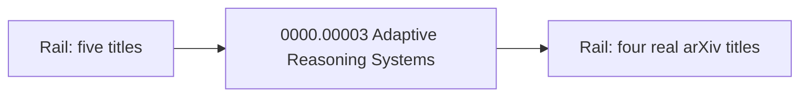

# Two-minute film

A quiet ad for the desk. One hundred twenty seconds. The run is already finished. The list on screen is Sohaib. Leave every paper. Do not open signup, do not press Delete, and do not press Run unless a paper still says Waiting.

Spoken pace is slow. About 215 words, so the picture can sit still while a sentence lands.

## Words on camera

Say the check.

- “95.2 is in the abstract and absent from the results.”
- “The table computes 4.5.”
- “The public count is 216.”
- “This claim needs a person.”

Leave these words out of the voiceover, the titles, and the captions: fraudulent, fraud, fake, fabricated, AI-written, written by AI, model-written, slop. A likeness score never becomes a line in this film. If a likeness figure is on screen, crop it out of the frame.

## Papers on the list

Paste these five, let the run finish, then record. Four are real arXiv papers. One is the paper this repo wrote.

Click only Adaptive Reasoning Systems. The sentences in the voiceover are the sentences in that PDF. The other four are on the rail so the list is real work beside it. Do not open them, and do not speak a verdict for them.

| Id | Title | Role in the film |
| --- | --- | --- |
| `0000.00003` | Adaptive Reasoning Systems | The paper we wrote. Click this. 95.2 is absent from the results. The table computes 4.5. 342 matches. The public count for first class is 216. |
| `1706.03762` | Attention Is All You Need | Real. Vaswani and coauthors, 2017. On the rail. This is the paper Adaptive Reasoning Systems cites. |
| `1810.04805` | BERT | Real. Devlin and coauthors, 2018. On the rail. |
| `2106.09685` | LoRA | Real. Hu and coauthors, 2021. On the rail. |
| `1512.03385` | Deep Residual Learning for Image Recognition | Real. He and coauthors, 2015. On the rail. |

## The film

### 0:00–0:03 · Open

Picture. Homepage, or a still of the desk. The line “A quiet desk” is readable. No cursor.

Voice. Silence. Music in, low.

Title. `ArxAudit`

### 0:03–0:14 · The job

Picture. The rail. All five titles readable: Adaptive Reasoning Systems, Attention Is All You Need, BERT, LoRA, Deep Residual Learning for Image Recognition. Slow drift. No click yet.

Voice. “A conference chair answers for every paper on the list. There is no time to re-check every citation, every number, and every table.”

### 0:14–0:20 · The name

Picture. Same rail. The cursor arrives and rests on **Adaptive Reasoning Systems**.

Voice. “ArxAudit reads that list, and opens the sentence that did not hold.”

### 0:20–0:26 · The desk

Picture. Click **Adaptive Reasoning Systems**. Let the open finish. PDF on one side, findings on the other. Hold.

Voice. “One desk. Five papers. The reading is already done.”

### 0:26–0:40 · 95.2

Picture. Click the **95.2** finding. Wait until the PDF marks that sentence. Hold on the mark for a full second after the voice stops.

Voice. “This paper says the model reaches 95.2 percent. The number sits in the abstract. It is absent from the results.”

Title, lower third. `Contradicted · absent from the results`

### 0:40–0:52 · 7.8

Picture. Click the **7.8** finding. If the table is on the page, leave it in frame.

Voice. “It also claims a gain of 7.8 points. The table is 89.2 minus 84.7. That comes to 4.5.”

Title. `89.2 − 84.7 = 4.5`

### 0:52–1:08 · The public table

Picture. Click the **342** finding and hold. Then click the **317** finding and hold.

Voice. “The paper names a public table, so the desk reruns it. 342 survived. That count matches. 317 in first class does not. The table has 216.”

Titles, in order. `Reproduced · 342` then `Could not reproduce · 216`

### 1:08–1:24 · The real papers

Picture. Back to the rail. Rest the cursor on **Attention Is All You Need**. The other three real titles stay readable: BERT, LoRA, Deep Residual Learning for Image Recognition. Do not click them.

Voice. “The other four papers are real arXiv papers. This one is Attention Is All You Need. The citation in the paper you just read points here.”

### 1:24–1:40 · How a card gets its word

Picture. Stay on one finding card. The reason sentence must be readable. No diagram.

Voice. “A number, a table, or a finished rerun is settled before a model speaks. Lya reads what is left. Jev is called only when Lya is not sure. Still unsure, and the card asks for a person.”

Title. `Number · Lya · Jev · a person`

### 1:40–1:50 · The line

Picture. The marked sentence, then a slow pull back to the rail. Hold until all four real titles are readable beside Adaptive Reasoning Systems. Do not click a real paper, and do not speak a verdict for one.

Voice. “A reason, tied to a passage. The chair still decides.”

### 1:50–2:00 · End

Picture. Cream card. Music fades on the last second.

Title.

`ArxAudit`
`A quiet desk for the papers a chair is responsible for.`

## What to record

Record one silent screen pass. Pause two seconds after every highlight. The voice is a separate take.

| File | What the frame contains | Length to keep |
| --- | --- | --- |
| `01-open` | Homepage or a still desk. “A quiet desk” readable. | 4 s |
| `02-rail` | Signed-in rail. All five titles readable. Cursor off, then on Adaptive Reasoning Systems. | 12 s |
| `03-open-paper` | Click Adaptive Reasoning Systems. PDF and findings both in frame. | 8 s |
| `04-95` | Click 95.2. The marked sentence fills the middle of the PDF. | 8 s |
| `05-78` | Click 7.8. Table or reason visible. | 8 s |
| `06-342` | Click 342. The word Reproduced is readable. | 6 s |
| `07-317` | Click 317. Could not reproduce is readable. | 6 s |
| `08-real` | Rail. Cursor on Attention Is All You Need. BERT, LoRA, and Deep Residual Learning readable. No click. | 16 s |
| `09-card` | One finding card, reason in focus, for the Lya and Jev line. | 10 s |
| `10-end` | Pull back to the rail, then cut to black or cream. | 8 s |
| `vo` | The voiceover, one quiet room, one take per paragraph. | 1:45 |

Browser setup before the first clip:

- Desk already signed in. List name Sohaib. Run already finished.
- One window, full screen. Bookmark bar hidden. No other tabs in the tab strip.
- Do Not Disturb on. Notifications off.
- Browser zoom at 110% so a finding is readable on a projector.
- Record 1920×1080, or a 1440p window you can crop to 1920×1080. 60 fps if the recorder offers it.
- Cursor large enough to see, and slow. Rest on the finding for half a second, click, then stay still until the mark appears.

Say the numbers as digits in the script and as words if the speaker prefers. On screen they stay digits: 95.2, 7.8, 4.5, 342, 216, 61.0.

## Edit

Use [Screen Studio](https://screen.studio/) on the Mac. It is the recorder and the editor. After you stop, it builds the zoom on each click, smooths the cursor, and can write captions on the machine. You do not keyframe the animation.

1. Record `02` through `10` as one pass. Automatic zoom on. Cursor smoothing on. Zoom speed slow.
2. If a zoom crops the PDF away from the findings, select that zoom and switch it to manual. Keep both columns in the frame. The marked sentence is the target, and the finding has to stay readable beside it.
3. Add the lower thirds as text overlays. Cream `#f4f0e6`, ink `#1c1915`, gold `#c4a15a`. Use the titles already written under each beat.
4. Generate captions in Screen Studio. Edit them until they match the voice lines. Two lines at a time.
5. Music under the voice, no lyrics, quiet enough that 4.5 and 216 stay clear. Fade the last second.
6. Export 1920×1080.

Record the voice in the same pass if the speaker can hit the numbers as the clicks land. If the take is rushed, export the picture and lay a separate voice take under it. CapCut is only for that layup and for plain captions. Leave its animated caption preset off.

Watch the export once with the sound off. Every title in this file should still be readable. Watch it once with your eyes closed. 95.2, 4.5, 216, and 61.0 should each be unmistakable.
