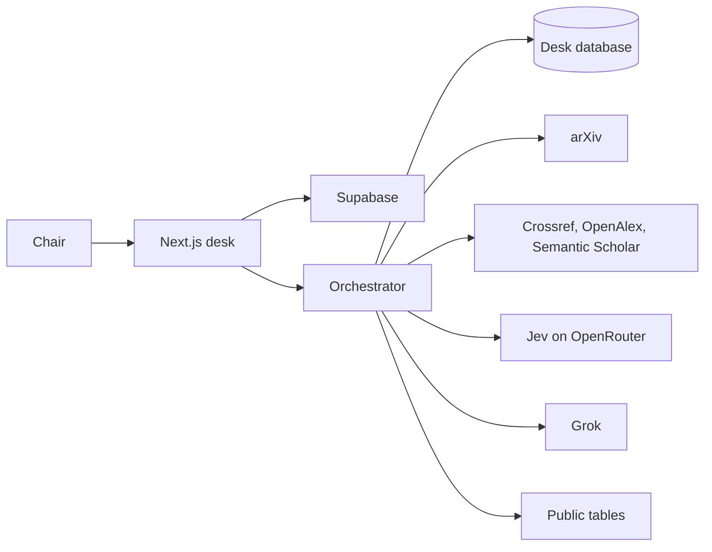
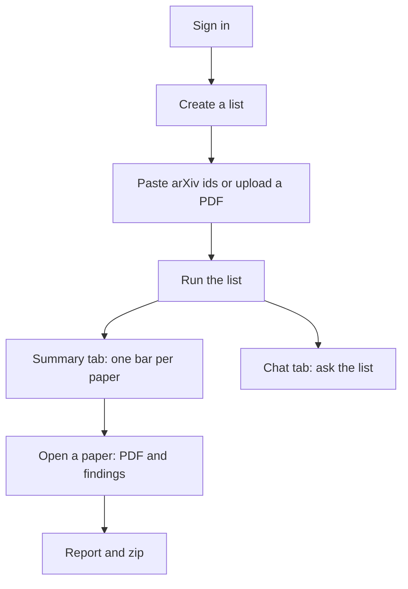
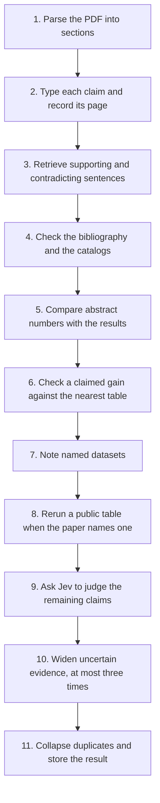
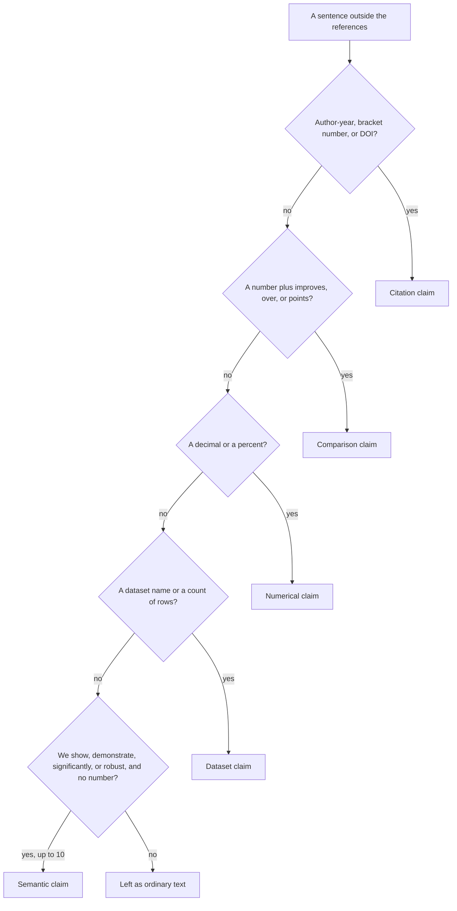
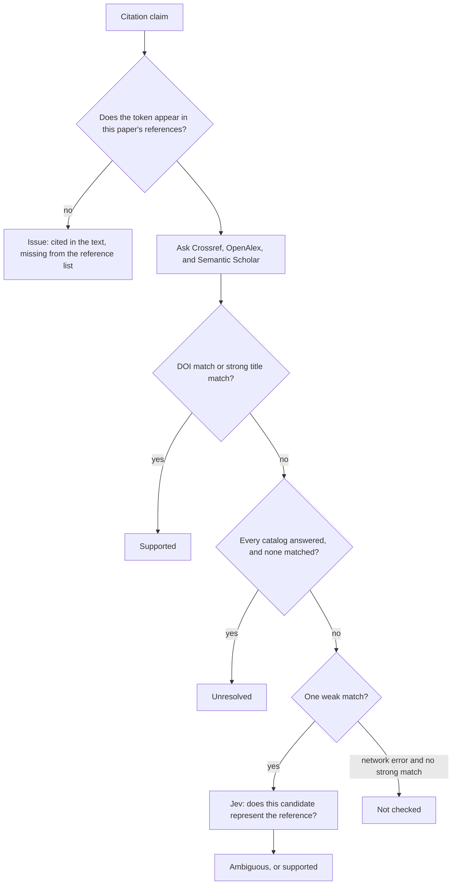
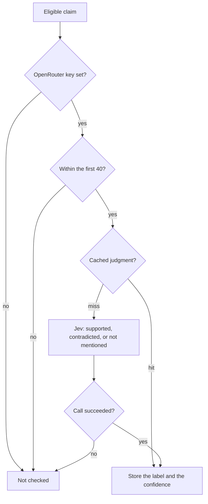
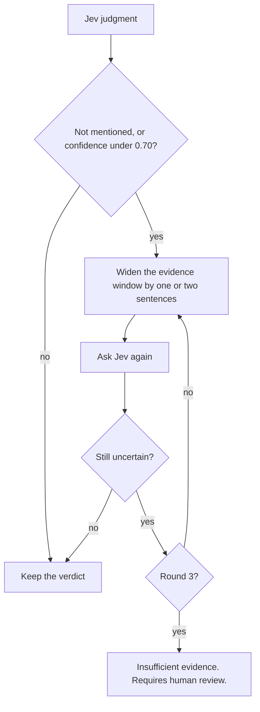
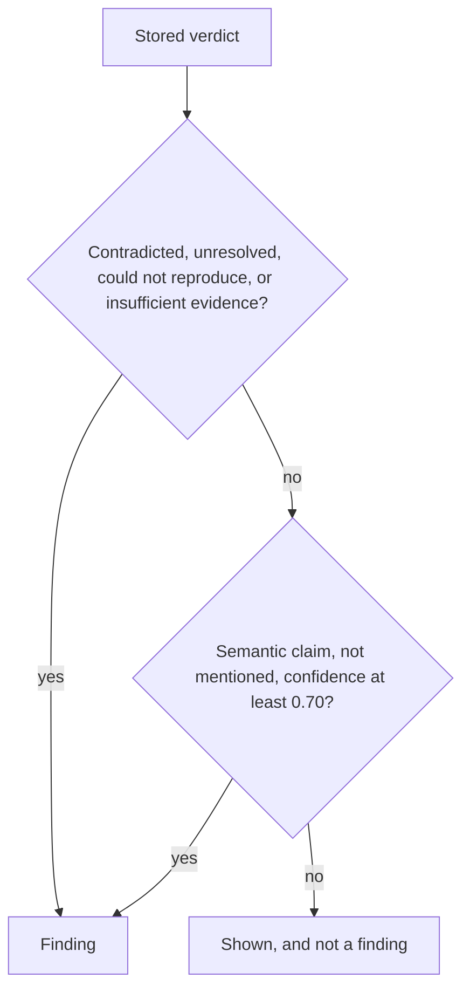
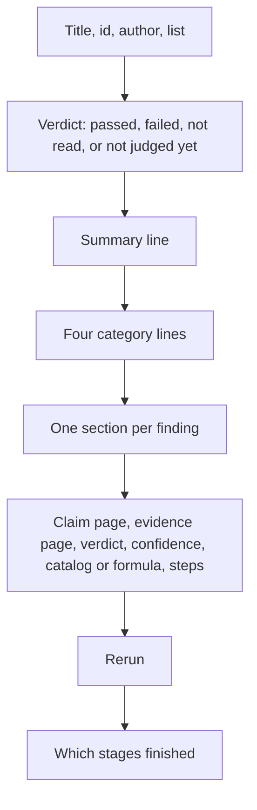

# How ArxAudit works

ArxAudit is a desk for a conference chair. The chair pastes arXiv ids. The desk reads each PDF and returns claims tied to pages. The chair watches the read, asks the list a question, and opens the sentence in the original PDF.

The desk does not call a paper fraudulent or written by AI. A likeness score never becomes a finding.

## The two programs

The screen is a Next.js app. Sign-in is Supabase. An unsigned visit to the desk goes to login. The screen calls the orchestrator, a FastAPI service. Keys for xAI, OpenRouter, and Kaggle stay on that service.

The desk database holds the list, each paper, its claims, its findings, the specialist trace, and the chat. Accounts live in Supabase. The owner of a list is the signed-in user.

## What the chair does

Chat and Summary are separate tabs. Chat answers from papers already read. Grok writes that prose and does not decide whether a claim holds. The thread is stored on the list. Summary is one card per paper: the title, a bar through the eleven stages, and the result. A finding jumps the PDF to the page where that sentence was found.

Three local papers are built in so a demo does not need the network:

| Id | Paper | What the read should show |
| --- | --- | --- |
| `0000.00001` | Hallucinated Metric Paper | Abstract says 95.2%. Results say 61.0%. Smith 2099 is missing from the references. |
| `0000.00002` | Measured Metric Paper | 61.0% appears in the abstract and the results. The citation is in the references. |
| `0000.00003` | Adaptive Reasoning Systems | The paper claims a 7.8 point gain. The table is 89.2 minus 84.7, which is 4.5. |

## One paper, eleven stages

Waiting papers are read one after another. Inside a stage, claims of the same kind run four at a time. The stages themselves stay in order.

Each stage writes a started sentence and a finished sentence. The Summary bar follows that trace.

### Parse

The PDF is opened and split into abstract, introduction, related work, methods, results, discussion, and references. The page of a sentence comes from searching the PDF, not from a model.

### Claims

Sentences are typed before any model sees them.

Each kept claim gets a stable id from the paper and the sentence, plus the page where the text was found.

### Evidence

Numerical, comparison, and semantic claims get two sets of sentences from the paper. The supporting set is the closest sentences overall. The contradicting set prefers another section that shares a unit, such as percent or accuracy, and states a different number. On the first fixture, the 95.2% claim is paired with the results sentence that says 61.0%.

Embeddings use MiniLM when that model is installed, and a hash embedder otherwise.

### Citations

A citation is checked twice.

A strong match is an exact DOI, or a title similarity of at least 0.85 with the author or the year within one year. Successful catalog answers are cached. A network failure stays not checked. It is not recorded as unresolved.

### Numbers

An abstract number is compared with the results section. If the results never state that number, the claim is contradicted. If they do, it is supported. Both pages are stored as evidence.

### Tables

A comparison claim is checked against the nearest table. The desk takes the Ours row, subtracts the best other row, and compares that with the claimed gain. The tolerance is 0.05 absolute or 1% relative.

On the demo paper the formula is `89.2 − 84.7 = 4.5`. The claim of 7.8 points is contradicted. That computation is kept, and Jev does not overwrite it.

### Dataset and reproduce

Named datasets are recorded. When a claim names a public table, the desk compiles it into a small allowed calculation: a count, a sum, a mean, or a comparison. A match is reproduced. A disagreeing result is could not reproduce. The desk does not retrain a model and does not run the paper's own code. A dataset sentence with no public table stays not checked.

### Verify

Jev judges numerical, comparison, and semantic claims that do not already have a table computation. The source text is the supporting lines, the contradicting lines, and any number in the claim that does not appear in another section.

With no key, the deterministic number check still runs. Jev's answers are cached by the claim text and the source text.

### Critic

This stage runs when a key is set. It looks at claims Jev already judged.

The claim text is never edited. A patch that would drop a number from the claim is rejected. The steps record "Round 2: widened to ±2 sentences" and the same for round 3.

### Stamp

Duplicate findings collapse. The paper is marked failed if any issue or any finding claim remains. Otherwise it is passed. A paper that could not be opened is not read.

Papers already stored keep the verdicts from the read that produced them. A later read uses the current checks. An old row does not change until that paper is queued again.

## What counts as a finding

Ambiguous and not checked are shown. They are not findings.

Screen words follow the stored verdict: Supported, Contradicted, Unresolved, Not found, Reproduced, Could not reproduce, Insufficient evidence, Requires human review, Not checked.

## The scoreboard

The headline counts claims analyzed and claims supported, then any nonzero failure counts. Each category line is passes over every claim of that kind.

| Line | Numerator | Denominator |
| --- | --- | --- |
| Citations resolved | Citation claims marked supported | Every citation claim |
| Internal consistency | Semantic claims marked supported | Every semantic claim |
| Numerical consistency | Numerical and comparison claims marked supported | Every numerical or comparison claim |
| Computational reproduction | Dataset claims marked reproduced | Every dataset claim |

A claim that was not checked stays in the denominator. It does not count as a pass and it does not appear in the failure headline. A line can therefore read `4 / 60`. Computational reproduction stays at zero until a public-table rerun returns reproduced or could not reproduce.

## The report

A judged list can be downloaded as a zip of these reports. A paper that has not been run yet says it has not been judged.

## What stays outside the chair's path

The older playbook scores a patch and can reuse it on a later paper. That API is separate. The desk does not load those patches. The recursion a chair can see is the three-round widening inside one paper.

The likeness probe can be measured. Its result stays off the finding list.
