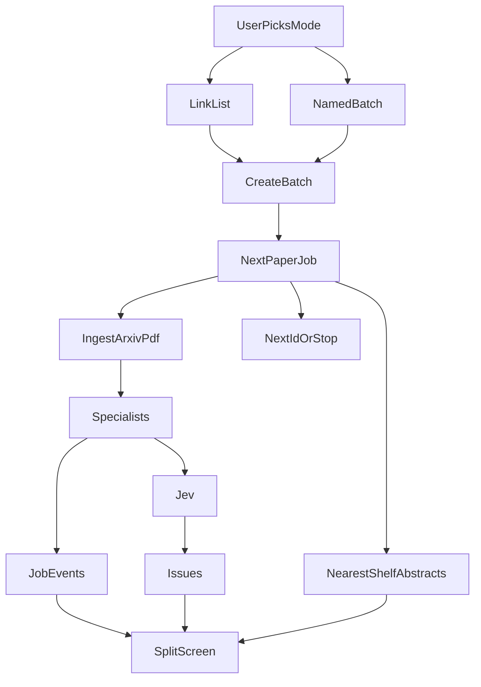
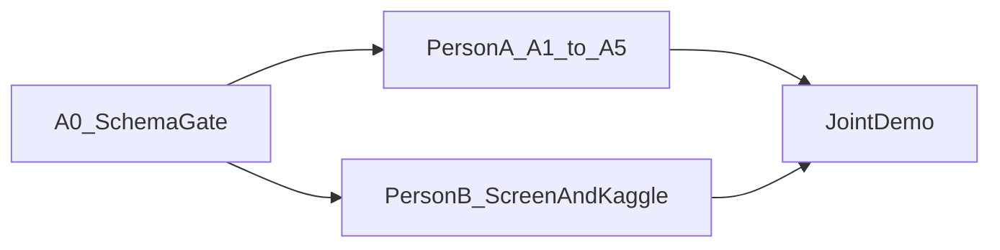

# ArxAudit batch audit

The product name is **ArxAudit**. The API product id is `arxaudit`. The page title is ArxAudit. Retire the StormCite name for this product: rename [docs/plan-stormcite.md](docs/plan-stormcite.md) to `docs/plan-arxaudit.md`, and add `arxaudit` beside `stormcite` in [services/orchestrator/models.py](services/orchestrator/models.py) and [packages/schema](packages/schema). Person B switches the home-page select in [apps/web/app/page.tsx](apps/web/app/page.tsx) to `arxaudit`. Keeping `stormcite` until that lands means the two tracks do not break each other. Landfall stays Landfall. Do not start Landfall. The issue rules stay as written in the current StormCite plan: a paper is flagged only for a failed citation, a number missing from results, a dataset name that does not resolve, a Kaggle or local test that disagrees, or a claim far from the paper’s own methods and results. A high AI-likeness score sorts the queue. If the probe’s holdout AUC is under 0.60, hide that column.

The orchestrator playbook stays in SQLite ([services/orchestrator/store.py](services/orchestrator/store.py)). Supabase is the online shelf and the live batch log. It does not replace fitness, patches, or Jev.

## Dataset

Do not use DAIGT. That corpus is student essays, not papers. Do not use the Kaggle set “AI-Generated vs Human-Written Scientific Abstracts” (`chaitanyajamble/...`). Its columns look synthesized, including a publication year running through 2026.

Host this shelf:

- **Training and shelf text:** [GPT vs. Human: A Corpus of Research Abstracts](https://www.kaggle.com/datasets/heleneeriksen/gpt-vs-human-a-corpus-of-research-abstracts). Paired titles, one human abstract and one GPT abstract, labels `ai_generated` and `is_ai_generated`. Human text comes from the Cornell arXiv Kaggle dump. The card says MIT, so the rows can be copied into Supabase. File is about 3.8 MB.
- **Richer neighbor set, only if the Hugging Face card allows redistribution:** [SciHRA-Detect](https://huggingface.co/datasets/mithu-ngl/SciHRA-Detect). 3,000 pre-2020 papers (1,659 arXiv), each with a human abstract, a GPT-4o revision, and a GPT-4o abstract, plus full text. If the license forbids storing the text, keep SciHRA out and use only the MIT abstracts.

Load a capped sample into Supabase, not the whole internet: 400 human abstracts and 400 AI abstracts from the MIT corpus. That is what the UI browses and what each review is compared against. The probe is a scikit-learn logistic regression on frozen `all-MiniLM-L6-v2` embeddings, with ROC AUC on a held-out split stored as one row. Contrastive fine-tuning stays deferred. The frozen encoder is the ship path unless a later run beats it.

Each reviewed paper shows the three nearest shelf abstracts (title, human or AI label, cosine) under the sentence “Nearest reference abstracts. This is not a verdict.”

## Supabase

New project. Keys in the gitignored `.env` only: `SUPABASE_URL`, `SUPABASE_SERVICE_ROLE_KEY`. The browser never sees the service role. Add both names to [.env.example](.env.example) with empty values. Anon key is read-only for the shelf and batch tables through RLS.

Tables, checked in as `supabase/migrations/001_shelf.sql`:

- `reference_items`: source, external id, title, abstract text, label (`human` or `ai`), domain, MiniLM embedding. Unique on source plus external id.
- `probe_meta`: one row, holdout AUC, row counts, `hidden` when AUC is under 0.60, trained-at time.
- `conferences`: `conference_id`, `name`, organizer `contact_email`.
- `batches`: `kind` is `links` or `batch`, optional `name` (required when `kind` is `batch`), optional `conference_id`, the arXiv id list, and when it was created.
- `paper_jobs`: one row per arXiv id, status (`queued`, `running`, `passed`, `contradicted`, `unresolved`, `error`), current specialist, orchestrator `run_id`, fitness, issue count, `author_name`, `author_email`, `contacted_at`.
- `job_events`: specialist name, state (`started`, `finished`, `failed`), short detail, time. This is the right-hand trace.

Enable Realtime on `paper_jobs` and `job_events`. The Next.js server is the only writer. If `SUPABASE_URL` is missing, the pipeline still runs and tests use a fake writer so pytest does not need the network.

pgvector holds the 384-d shelf embeddings. Nearest neighbors are a SQL cosine query, limited to 3. The paper’s own sentence index stays FAISS inside the run, as the current plan already says. Those are different searches: FAISS answers “does this paper support this claim?” and Supabase answers “which labeled abstracts does this abstract resemble?”

## Who builds what

Person A and Person B work at the same time after one short gate. One subagent per step. A step on track A may run beside a step on track B only when both say parallel-ok and their file lists do not overlap. That is the normal case below: the lists never overlap.

- **Person A — evidence and API.** `docs/plan-arxaudit.md`, [services/orchestrator](services/orchestrator), [packages/schema](packages/schema), `supabase/`. Does not edit `apps/web` or `kaggle/`.
- **Person B — screen and Kaggle.** `apps/web/**` and `kaggle/**`. Does not edit the orchestrator, schema package, or Supabase SQL. The Kaggle section below is the handoff for Person B.

Person B does not wait for the live server. The gate writes the request and response shapes into [packages/schema/batch.json](packages/schema/batch.json). Person B copies those shapes into `apps/web/app/audit/fixtures/` and builds the whole screen against those fixtures. Person A implements `POST /batches` against the same file. The only join is the last demo, after both tracks are done.

## Frozen contract

The gate adds these objects and does not change them afterward. Field names:

- Create batch: `product` (`arxaudit`), `kind` (`links` or `batch`), `name` (string or null; required when `kind` is `batch`), `arxiv_ids` (array of strings, max 8).
- Batch: `batch_id`, `kind`, `name`, `arxiv_ids`, `created_at`.
- Paper job: `job_id`, `batch_id`, `arxiv_id`, `run_id`, `status`, `specialist`, `fitness`, `issue_count`.
- Event: `event_id`, `job_id`, `specialist`, `state` (`started`, `finished`, `failed`), `detail`, `created_at`.
- Shelf row: `title`, `label` (`human` or `ai`), `text`, `cosine`.
- Probe: `auc`, `hidden`.
- Conference: `conference_id`, `name`, `contact_email`.
- Issue reason: `issue_type` (`citation`, `number`, `dataset`, `test`, `support`), `claim_text`, `evidence_span`, `jev_label`, `reason`. `reason` is one sentence a chair can read. It is never "this paper is fraudulent" and it never uses AI-likeness as the reason.
- Paper contact: `author_name`, `author_email`, `contacted_at`.

`GET /batches/{id}` returns the batch, its jobs, the events for those jobs, and the selected job's claims once a run exists. `GET /conferences/{id}` returns the conference and each paper with its issue reasons. `PATCH /papers/{id}` accepts `author_email` and `contacted_at`. Person B's fixture `apps/web/app/audit/fixtures/review.json` has two papers, one running specialist, one issue, and three shelf neighbors. `apps/web/app/audit/fixtures/conference.json` has one conference, two papers, and two different issue reasons.

## Two ways to start

The user picks the mode. Both modes call the same `POST /batches` and the same specialist loop. The difference is whether the collection is kept.

- **Link list** (`kind: links`). Paste arXiv links or ids. Review starts immediately. No name. The left column heading is "This review." Cap 8 papers.
- **Saved batch** (`kind: batch`). A name is required, then the same paste box. The batch stays in the left column and can be reopened. Cap 8 papers. A saved batch can be attached to a conference. A link list cannot.

`POST /runs` today rejects anything that is not a fixture ([services/orchestrator/app.py](services/orchestrator/app.py)). `POST /batches` accepts `product: arxaudit`, `kind`, optional `name`, and `arxiv_ids`. Process the list in order. One paper is one orchestrator run. A download or parse error marks that job `error` and the next id starts.

For each id, `export.arxiv.org` supplies the abstract and the PDF. PyMuPDF extracts the text. Then the same specialist order already named in the paper-audit plan, with one `job_events` row at the start and end of each:

`ingest`, `sections`, `retrieve`, `extract`, `resolve`, `numbers`, `support`, `provenance`, `kaggle_runner`, `jev`

Grok (`grok-4.6` on `https://api.x.ai/v1`) writes claims only. Jev, on the OpenRouter Decisions API, judges those claims against the evidence span. Parsers, Crossref, Semantic Scholar, and pytest run before Jev. A patch still cannot delete a failed citation. Replay of one paper stays `POST /runs/{id}/replay` and still has to keep the same issues.

Tests on screen come from Person B's Kaggle agents. Person A reads `kaggle/output/` and does not call the `kaggle` CLI. A claim with no dataset slug records `not_run` and the pane says why.

## Screen

New route `apps/web/app/audit`, separate from the fixture home at [apps/web/app/page.tsx](apps/web/app/page.tsx). Split the viewport into three columns.

- **Left:** the papers in this review or saved batch. Each arXiv id, a status pill, the current specialist name, and the issue count. The selected row stays highlighted. Saved batches are listed by name under "Batches." A link list is labeled "This review" and is not added to that list. A second short list, "Reference shelf," shows a page of Supabase abstracts with a human or AI chip so the dataset is visible before any review starts.
- **Center:** the selected paper. Title, authors, arXiv link. Claims appear as each specialist finishes, not only at the end. Each issue shows type, span, Jev label, and confidence. Under the abstract, three neighbor cards from the shelf. Per-section AI-likeness bars, or the exact hidden sentence when AUC is under 0.60: “Probe below 0.60 AUC on the holdout. AI-likeness hidden.”
- **Right:** a vertical trace of the ten specialists. The active one is marked running. The bottom of the column is the test log: last 40 lines, `kaggle` or `local` or `not_run`, and the kernel URL only when a push happened.

Above the columns, a mode switch: "Review links" or "Save as batch." The batch mode shows a name field. The paste box takes one arXiv link or id per line. The button reads "Review links" or "Save batch" to match the switch. Empty state names the shelf counts and asks the user to pick a mode. Poll the orchestrator run for the claim payload, and subscribe to Supabase for job and event changes so the trace moves while a paper is still inside a specialist.

A link in the header opens the conference dashboard. Copy stays an audit, not a fraud verdict. The page title is ArxAudit. No `NEXT_PUBLIC_` keys.

## Conference dashboard

Conferences that use the site get a dashboard at `apps/web/app/audit/conferences`. A chair creates a conference, attaches one saved batch, and manages every paper in it.

Each row shows the title, arXiv id, author name, author email, status, and the issue reasons for that paper. The reasons are only the audit issues: a citation that did not resolve, a number missing from the results, a dataset name that did not resolve, a test log that disagrees, or a claim far from the paper's own methods and results. AI-likeness may sort the list when the probe is visible. It is labeled "not a reason to email" and it is left out of the email. If the probe is hidden, the column is absent. There is no reject button and no verdict posted to X.

**Email.** The row action is "Email about these issues." It opens the organizer's mail client with a `mailto:` link. The To line is `author_email`. The subject is the paper title. The body lists each `reason` sentence, the evidence span, and the arXiv link. The app does not send mail and does not store an SMTP key. If `author_email` is empty, the action is "Add author email" and saves through `PATCH /papers/{id}`. Clicking the mailto link sets `contacted_at` so the dashboard can show which papers already have a draft. arXiv metadata supplies the author name. It usually does not supply the email, so the chair types that in.

## Kaggle, for Person B

This block is Person B's. Person A does not run these commands and does not edit these files. Subagents are `generalPurpose`. Keys `KAGGLE_USERNAME` and `KAGGLE_KEY` stay in the gitignored `.env`. Never print them. Never `NEXT_PUBLIC_`.

The agents pull Kaggle with the CLI, then the screen links to the same pages. Two kernels, not three. The contrastive kernel stays deferred.

**Dataset already chosen.** [GPT vs. Human: A Corpus of Research Abstracts](https://www.kaggle.com/datasets/heleneeriksen/gpt-vs-human-a-corpus-of-research-abstracts). Slug `heleneeriksen/gpt-vs-human-a-corpus-of-research-abstracts`. Labels `ai_generated` and `is_ai_generated`. Do not switch to DAIGT or to `chaitanyajamble/ai-generated-vs-human-written-scientific-abstracts`.

**K1. Pull the dataset page and the files.** Files: `kaggle/DATASETS.md` only.

1. `kaggle datasets list -s "gpt vs human a corpus of research abstracts"`.
2. `kaggle datasets download -d heleneeriksen/gpt-vs-human-a-corpus-of-research-abstracts -p kaggle/downloads --unzip`.
3. `kaggle datasets list -s "tabular classification"` and pick one small public CSV with a documented target column. That slug is the one a demo claim may rerun. Do not pick it before this search.
4. Write both slugs, the label column, the target column, the download commands, and the full `https://www.kaggle.com/datasets/...` URLs into `kaggle/DATASETS.md`.

Verify: `test -s kaggle/DATASETS.md` and `rg -n "slug:" kaggle/DATASETS.md` shows two slugs. The return includes both dataset URLs.

**K2. Probe kernel.** Files: `kaggle/probe/**` only. Push a kernel that downloads the abstract dataset, embeds with frozen MiniLM, fits logistic regression, and writes `auc.json` plus `probe.joblib`. `kaggle kernels push`, poll up to 20 minutes, `kaggle kernels output` into `kaggle/output/probe/`. `auc.json` is `{ "auc": number }`. Record the kernel URL in `kaggle/DATASETS.md`.

**K3. Claim kernel.** Files: `kaggle/claim_tests/**` and `kaggle/output/claim/**`. For a claim that names the tabular slug, push pytest and poll 8 minutes. Write `kaggle/output/claim/results.json` with `where` (`kaggle` or `local`), `status` (`match`, `mismatch`, `missing_row`, or `not_run`), `log` (last 40 lines), and `kernel_url`. On timeout, run the same pytest locally, set `where` to `local`, and still keep the kernel URL. Do not push again when `results.json` already exists for that claim id.

Person A reads those output files. If they are missing, Person A's tests use a 4-row fixture and do not fail the build.

## Build order

### Gate, then parallel

**A0, Person A only.** Files: `packages/schema/batch.json`, `docs/plan-arxaudit.md`, [services/orchestrator/models.py](services/orchestrator/models.py). Add `arxaudit` without removing `stormcite`. Write the frozen contract into `batch.json`. Rename the product doc and put this design in it. Do not edit `apps/web`. When A0's verify exits 0, start A1 and B1 together.

### Person A

Serial within the track. Parallel-ok with every Person B step. Do not edit `apps/web` or `kaggle/`.

1. Add the SQL migration, including `kind` and `name`, and a Python writer that no-ops without `SUPABASE_URL`. The abstract slug is already pinned in this plan. Do not write `kaggle/DATASETS.md`.
2. Load the 800-row shelf and embeddings. Default tests use a 4-row fixture and a fake embedder. If `kaggle/downloads/` already has the CSV, load from that file instead of the fixture.
3. Train the probe, write `probe_meta`, and hide AI-likeness under AUC 0.60. If `kaggle/output/probe/auc.json` exists, store that AUC and do not retrain.
4. arXiv list ingest, section split, citation, number, support, and local claim-test specialists, each emitting `job_events`. Fixture PDF only. No network in the default test. If `kaggle/output/claim/results.json` exists, the `kaggle_runner` specialist returns that file instead of calling Kaggle.
5. `POST /batches`, `GET /batches/{id}`, `POST /conferences`, `GET /conferences/{id}`, and `PATCH /papers/{id}` matching `batch.json`. Both `links` and `batch`. A saved batch may set `conference_id`. A link list may not. Sequential runs. Jev on the claims. Playbook replay unchanged. A missing `name` on `kind: batch` returns 400.

### Person B

Start here. The screen steps and the Kaggle steps are parallel-ok with each other, because `apps/web/**` and `kaggle/**` do not overlap, and both are parallel-ok with every Person A step. Starts at the same time as A1. Do not edit the orchestrator, `packages/schema`, or `supabase`.

Screen. Verify with `tsc` against fixtures, not against a running API. Do not edit `kaggle/` in these steps.

1. Add `apps/web/app/audit/fixtures/review.json` matching the frozen contract. Empty split screen reads that file. Switch the home-page product option to `arxaudit`.
2. Mode switch: "Review links" or "Save as batch," with a name field only for the saved batch. Submit writes the fixture shape into component state. A named batch appears under "Batches." A link list is labeled "This review" and is not stored there.
3. Center column: claims, Jev label, three shelf neighbor cards, and the hidden-AUC sentence when `probe.hidden` is true.
4. Right column: the ten specialists, the running state, and the last 40 lines of the test log with `kaggle`, `local`, or `not_run`. Link the dataset URL and the kernel URL from `kaggle/DATASETS.md` when that file exists. The fetch helper calls `POST /batches` and `GET /batches/{id}` using the frozen field names. Tests render the fixture and do not require the server.
5. Conference dashboard from `apps/web/app/audit/fixtures/conference.json`. List the papers, show each issue reason, and render "Email about these issues" as a `mailto:` link whose body contains those reasons and does not contain the word fraudulent or an AI-likeness score. A paper with no `author_email` shows "Add author email" instead.

Kaggle. Do K1, then K2, then K3 from the section above. Do not edit `apps/web` in these steps. K1 may start beside screen step 1.

### Join

After A5, screen step 5, and K3 all pass, the parent runs one link-list review, one named batch of two arXiv ids, and opens the conference dashboard. Record both ids, both modes, and the mailto subject for the paper that has an issue. This is the only step that needs both people finished.

### Done when

The hallucinated fixture still produces a citation or number issue. A human fixture does not produce that same issue. The shelf shows both human and AI labels. The screen can start from a pasted link list or from a named batch, and both show the specialist trace. The conference dashboard lists each paper with its reasons, and the email link carries those reasons. Person B's screen tests passed before this live check.

