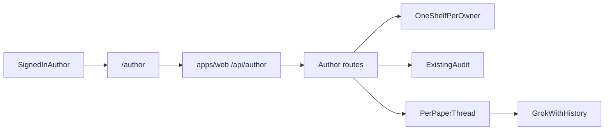

# Author paper chat

The conference desk stays the chair tool: many papers, one thread, short replies, `@` to name a paper. Authors get a separate path. One signed-in person pastes an arXiv id (or uploads a PDF), the existing audit runs, and a new chat is about that paper only. They can ask many follow-ups. Chat still cannot change a stored verdict, and it still must not call a paper fake, fraudulent, fabricated, or AI-written.

Both tracks implement the contract below. Neither waits for the other. Person A does not edit `apps/web`. Person B does not edit `services/orchestrator`.

## Shared contract

Person A returns these shapes. Person B builds against the same shapes, with a fixture at `apps/web/app/author/fixtures/paper.json` until the proxy is live.

- `POST /author/papers` body `{owner, arxiv_id}` or a PDF upload. Creates the owner’s shelf if needed, adds one paper, and starts the read. Response: `{job_id, arxiv_id, title, status}`.
- `GET /author/papers?owner=` response `{papers: [{job_id, arxiv_id, title, status}]}`.
- `GET /author/papers/{job_id}` response is one paper from the existing desk read (claims, issues, pages), not a conference.
- `POST /author/papers/{job_id}/ask` body `{question}`. Response `{answer, quotes, trace, action}`. `action` stays `null` or `{type: refuse|explain|open|list, ...}` as chat does today.
- `GET /author/papers/{job_id}/messages` response `{messages: [{role, text, quotes?}]}`.

No `conference_id` in these responses. The shelf can hold several of that person’s papers. The screen always shows one paper and its own thread.

## Person A — API

Files: [services/orchestrator/author.py](services/orchestrator/author.py) (new), [services/orchestrator/app.py](services/orchestrator/app.py) (route lines only), [services/orchestrator/tests/test_author.py](services/orchestrator/tests/test_author.py) (new). Do not rewrite [services/orchestrator/desk.py](services/orchestrator/desk.py). Call `create_user_conference`, `add_submissions`, `add_upload`, and `paper_desk` from the new module.

- One shelf per owner: a conference named so it can be found again, recorded in a small `author_shelves` table inside `author.py`. Chair conferences are untouched.
- Adding a paper starts the existing audit. The author does not press a separate “run the queue” control.
- Messages live in a new `author_messages` table keyed by `job_id`, so two papers do not share a thread.
- The author prompt is new and lives in `author.py`. It answers one author about one paper, may use a few paragraphs, and includes the last 12 stored turns in the Grok call. Today’s chair call in `_grok_answer` sends only the current question and says “a few sentences”; leave that path alone.
- Ground the answer in that paper’s stored text, issues, and claims. If the read has not finished, say so.
- Verdict edits still return `action: refuse` and the existing sentence: “The desk does not change a verdict from chat. The stored read stays as it is.” Grok is not called for that.
- Tests use `ARX_EMBEDDER=hash`. Cover: a second paper is not quoted when the question is about the first; a follow-up is sent with the earlier turn; a verdict change does not call Grok; the reply has none of the banned phrases; an empty question is 400.

Verify: `services/orchestrator/.venv/bin/python -m pytest tests/test_author.py -q` from `services/orchestrator` (needs unsandboxed pytest so the venv is visible).

## Person B — screen

Files: `apps/web/app/author/**` (new), `apps/web/app/api/author/**` (new proxies, same auth as the desk proxies), [apps/web/middleware.ts](apps/web/middleware.ts) (treat `/author` like `/desk`; honor `?next=/author` so login does not always dump the author on the chair desk), [apps/web/app/(site)/page.tsx](apps/web/app/(site)/page.tsx) (one author link beside the chair account link). Do not edit `apps/web/app/desk/[id]/ask.tsx`. The chair thread stays.

The page is one paper plus a chat, not a conference list.

- Empty state: one arXiv field and a PDF upload. After submit, that paper is the only thing on screen.
- A slim paper card: title, status, and the counts already on a desk paper. A short shelf switcher if they have more than one paper.
- The thread is the main visual. Cream `#f4f0e6`, ink `#1c1915`, gold `#c4a15a`, rust for a contradicted mark, Newsreader for the title, IBM Plex Sans for the messages. No framer-motion. `prefers-reduced-motion` keeps the thread still.
- Composer fixed to the bottom. Above it, question chips the author can send as-is: what to fix first, which citation failed, whether the abstract number is in the results, what still needs a person, explain the formula, what passed. Chips are local. They do not add API behavior.
- A reply can quote a stored passage. Choosing a quote opens the existing PDF pane from [apps/web/app/desk/pdf-view.tsx](apps/web/app/desk/pdf-view.tsx) beside the thread on a wide screen.
- While the paper is still running, the card shows the current pass and the thread can still be asked; the answer is allowed to say the read has not finished.
- Proxies call the contract above with the signed-in owner. Keys stay on the server.

Verify: `node apps/web/node_modules/typescript/bin/tsc --noEmit --pretty false -p apps/web/tsconfig.json`, then open `http://127.0.0.1:3000/author` signed out (lands on login) and, once signed in, paste an id, send two questions, and open a quote. Check the chair desk at `/desk` still lists conferences.

## Join

After both tracks pass, Person B points the proxies at the live orchestrator and repeats the two-question check against a real paper. No change to chair ask, voice, or the red-status rules.

## Build order

1. Person A: author shelf, add paper, start the read, list and get one paper, with tests.
2. Person A: per-paper ask with history, author prompt, verdict refuse, tests. Serial with step 1. Parallel-ok with Person B.
3. Person B: `/author` page, auth next-param, homepage link, fixture-backed paper card. Parallel-ok with every Person A step.
4. Person B: chat thread, question chips, quote-to-PDF, API proxies. Serial with step 3.
5. Join: point the author page at the live API and check two questions plus the chair desk.
