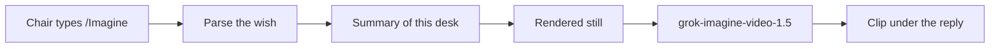

# Chat `/Imagine`

A chair types `/Imagine` in the conference chat, then whatever they want the clip to emphasize. The desk answers with a short animated summary of the papers on that list right now. The words after the command steer the motion. The facts in the clip come from the stored read: titles, statuses, and issue counts. Imagine does not invent a finding, a number, or a verdict.

Do this one chunk at a time. Run that chunk’s verify command and read the output before the next chunk. One subagent per chunk. The subagent does not start the next chunk and does not edit files outside its list.

The token is exactly `/Imagine`. It may sit anywhere in the message. The rest of the message, with that token removed, is the wish. A bare `/Imagine` still summarizes the whole list. A message without the token stays on the existing chat path.

## What the reply contains

`POST /desk/conferences/{id}/ask` keeps its current fields. An `/Imagine` turn adds `imagine`:

- `url`: the video URL, or `null` when the clip was not made
- `prompt`: the wish, or `""` when they sent only `/Imagine`
- `summary`: the plain-text summary the still was drawn from
- `label`: `Generated from this desk. Not a finding.`

The `answer` is that same summary in a few sentences, plus one line that the clip is ready, or that the clip was not generated. `action` stays `null`. Grok chat is not called. A verdict is not changed.

Normal questions do not include `imagine`.

## Chunks

### I1 — Recognize the command

- Subagent: `generalPurpose`
- Files: `services/orchestrator/imagine.py`, `services/orchestrator/tests/test_imagine.py`
- Do:
  1. `parse_imagine(question) -> str | None`.
  2. Return `None` when `/Imagine` is absent. Return `""` for a bare `/Imagine`. Return the remaining text, trimmed, when the token sits at the start, middle, or end.
  3. Do not treat `imagine`, `/imagine`, or a word that merely contains those letters as the command.
- Verify: `services/orchestrator/.venv/bin/python -m pytest tests/test_imagine.py -q` from `services/orchestrator`
- Pass: exits 0. Tests cover absent, bare, start, middle, and a near-miss.

### I2 — Summarize this desk

- Subagent: `generalPurpose`
- Depends on: I1
- Files: `services/orchestrator/imagine.py`, `services/orchestrator/tests/test_imagine.py`
- Do:
  1. `desk_summary(name, papers) -> str` from the papers already on the conference. Each line has the title or arXiv id, the status, and the counts of stored issues by `issue_type`.
  2. An empty list says the desk has no papers yet.
  3. Leave AI-likeness out. Do not add a finding that is not already on the paper.
- Verify: `services/orchestrator/.venv/bin/python -m pytest tests/test_imagine.py -q` from `services/orchestrator`
- Pass: exits 0. A fixture with one citation issue and one number issue appears as those two counts. An empty list does not invent a paper.

### I3 — Answer `/Imagine` from the chair chat

- Subagent: `generalPurpose`
- Depends on: I2
- Files: `services/orchestrator/desk.py`, `services/orchestrator/imagine.py`, `services/orchestrator/tests/test_imagine.py`
- Do:
  1. At the start of `ask_conference`, if `parse_imagine` returns a string, skip `voice.finish` and `_grok_answer`.
  2. Build the summary from that conference’s papers. Return `answer`, `imagine` as specified above with `url: null`, `quotes: []`, `trace: []`, `papers` set to the arXiv ids on the list, and `action: null`.
  3. Store the turn. Add `imagine_json` on `desk_messages` the same way other columns are added, and return it from `conference_messages` on desk rows.
  4. A normal question still has no `imagine` key, or the key is absent. Existing ask behavior stays.
- Verify: `services/orchestrator/.venv/bin/python -m pytest tests/test_imagine.py tests/test_desk.py -q` from `services/orchestrator`
- Pass: exits 0. A test posts `/Imagine the citations` and asserts Grok was not called, the summary names a stored issue, and a later `GET .../messages` still has the imagine payload. A test posts a normal question and gets no video payload.

### I4 — Still, then the clip

- Subagent: `generalPurpose`
- Depends on: I3
- Files: `services/orchestrator/imagine.py`, `services/orchestrator/desk.py`, `services/orchestrator/tests/test_imagine.py`
- Do:
  1. Render a PNG still from the summary text. The still shows the conference name and the summary lines. No extra findings.
  2. `imagine_clip(summary, wish, *, client)` sends that still plus a motion prompt. The prompt says to animate the still as a short briefing and to follow the wish. It tells the model not to add papers, numbers, or verdicts.
  3. The xAI client posts `https://api.x.ai/v1/videos/generations` with model `grok-imagine-video-1.5`, `duration` 6, and `image` as a PNG data URI, then polls `GET /v1/videos/{request_id}` until `status` is `done`. Use `XAI_API_KEY`. If the key is missing, or the call fails, return `url: null` and do not raise. Tests monkeypatch the client. No test hits the network.
  4. `ask_conference` fills `imagine.url` from that client.
- Verify: `services/orchestrator/.venv/bin/python -m pytest tests/test_imagine.py tests/test_desk.py -q` from `services/orchestrator`
- Pass: exits 0. The fake client receives the still and the wish. A missing key leaves `url` null and records no HTTP call.

### I5 — Play it in the thread

- Subagent: `generalPurpose`
- Depends on: I4
- Files: `apps/web/app/desk/[id]/ask.tsx`, `apps/web/app/desk/reply.tsx`, `apps/web/lib/desk.ts`
- Do:
  1. When a desk turn has `imagine.url`, show the video under the reply. Under the video, the visible text is `Generated from this desk. Not a finding.`
  2. When `imagine` is present and `url` is null, show no player. The answer text already says the clip was not generated.
  3. Reloaded messages keep the player when `imagine` was stored.
  4. The empty-thread note tells the chair they can type `/Imagine` and then what they want the clip to emphasize.
- Verify: `node apps/web/node_modules/typescript/bin/tsc --noEmit --pretty false -p apps/web/tsconfig.json` from the repo root
- Pass: exits 0. The label string is in `apps/web/app/desk`.

## Done when

A chair can send `/Imagine` plus their own words in the conference chat and see a six-second clip of the current list, labeled as generated. Sending the same thread a normal question does not make a clip. Tests for I1 through I4 exit 0, and the I5 typecheck exits 0.
