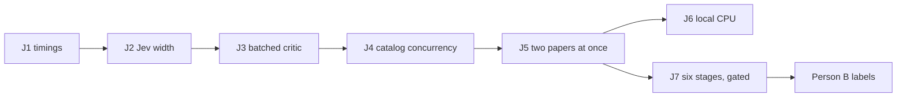

# Plan: faster paper reads by leaning on Jev

ArxAudit, Person A track. One paper today runs eleven stages one after another, and a conference list runs its papers one after another. Most of the wall-clock on a live paper is network round trips: Jev calls issued four at a time, a second Jev pass that walks uncertain claims one by one, three catalog GETs issued back to back per citation, and a Grok call per dataset sentence. This plan cuts the number of serial round trips, moves every uncertain semantic judgment into two batched Jev fan-outs, and keeps the deterministic checks that are cheaper than a judge.

Follow [AGENTS.md](../AGENTS.md). One subagent per step. Verify. Then the next step. Rules from [plan-orchestrator.md](plan-orchestrator.md) and [plan-arxaudit.md](plan-arxaudit.md) still apply: Jev decides, Grok writes prose, parsers and lookups run before Jev, typed patches only, claim text never changes.

## Where the time goes today

Read from the code, not guessed. Numbers in parentheses are the current limits.

**List level.** `desk._drain` runs `for job_id in job_ids: _audit_job(job_id)`. One thread per conference, papers strictly sequential. Paper N+1's PDF download (`batches.resolve_paper` → `_arxiv_fetch`, 45 s timeout) does not start until paper N's `stamp` finishes.

**Stage level.** `paper_audit.audit_paper` walks `SPECIALISTS = list(models.STAGES)` (11 stages) in order and emits `started`/`finished` around each. Nothing overlaps across stages. Inside a stage, `_map_claims` fans out over claims with `_POOL_WORKERS = 4`.

Per stage, the sinks:

| Stage | Function | What costs time | Current limit |
| --- | --- | --- | --- |
| `evidence` | `evidence.PaperIndex.__init__` → `_chunks`, `_vectors` | `claims.find_page` calls `page.search_for` per sentence (O(sentences × pages)); MiniLM embeds one sentence at a time (disk-cached by PDF sha256 after the first read); each claim then embeds its text twice (`verifier` + `falsifier`) | pool 4 |
| `citations` | `references.attach` → `catalogs.lookup` | Crossref, OpenAlex, Semantic Scholar GETs issued **sequentially** per citation claim (`TIMEOUT = 6.0` each, up to 18 s worst case per claim); `parse_references` re-parsed per claim because `citations()` calls `attach([claim], refs)` inside `_map_claims`; `catalogs.decide` → `_judge_weak` fires an extra **sequential** Jev call for any score in [0.5, 0.85) | pool 4, sqlite `catalog_cache` |
| `numbers` | `paper_audit._settle_abstract_number` | `_paper_without_claim` re-opens the PDF, re-extracts all text, and runs `tables.read_tables` (PyMuPDF `find_tables` on every page) **per abstract numeric claim**; `_text_page` reopens the PDF twice more | pool 4 |
| `tables` | `tables.annotate` → `read_tables` | `find_tables` on every page again | serial |
| `reproduce` | `repro.reproduce` | per dataset sentence, in series: `compiler.compile_claim` falls through to `repro.ask_model` (Grok chat, 30 s timeout) when no regex matches; `datasets.resolve` may shell out to `kaggle datasets list` (20 s) and call Jev on a 2-way tie; `download_table` (120 s); `push_kernel` polls up to 120 s when `ARX_KAGGLE_KERNEL=1` | serial, no pool |
| `verify` | `verify.judge_claims` | one `jev.judge_claim` POST per claim, each opening a fresh `httpx.Client` (new TLS handshake, no keep-alive, default httpx timeout) | `_POOL_WORKERS = 4`, `DEFAULT_CAP = 40` → up to 10 serial waves |
| `critic` | `verify.review_uncertain` | a plain `for claim in claims` loop with **no pool**; each uncertain claim (`not_mentioned`, or `supported`/`contradicted` under `REVIEW_CONFIDENCE = 0.70`) gets up to `MAX_ROUNDS - 1 = 2` more Jev calls; `roles.critic` always returns `neighbors:2` for the `evidence` target, so round 3 re-sends round 2's window with the same neighbor rows appended a second time. Round 3 is a duplicate call. Round-2/3 calls bypass `jev_cache`. | serial; up to 2 × uncertain claims round trips |
| `stamp` | `_annotate_pages` | reopen PDF, `search_for` per issue per page | serial |

Grok appears in the paper pipeline only in `repro.ask_model` (and `compiler._from_model` through it). Voice and "ask the desk" Grok calls are outside the paper loop and are not touched here.

Measured baseline on fixtures (fake Jev at 50 ms, fake catalog at 50 ms, hash embedder, no network): `tests/test_parallel.py` reads `demo_paper.pdf` in about 1.7 s; the hallucinated fixture reads offline in about 1.0 s. Local CPU is not the bottleneck on fixtures. On a live paper the serial round trips are: for ~25 judged claims and ~8 uncertain ones, `verify` costs ~7 waves and `critic` costs ~16 sequential calls, so `critic` alone is longer than `verify` even though it judges fewer claims.

## The speed idea

1. Judge in two batched fan-outs, not one pass plus a serial critic walk: round 1 for every judged claim, round 2 once for every still-uncertain claim with its window already widened to ±2. Skip the duplicate round 3.
2. Widen the Jev fan-out (4 → 8 in flight, env-tunable) and reuse one HTTP client so a wave costs one round trip, not four TLS handshakes.
3. Fire the three catalog GETs for a citation at the same time, parse the reference list once, and defer the weak-catalog Jev question into the verify batch instead of calling Jev inside the citations stage.
4. Read tables and page text once per paper; stop reopening the PDF per claim. Batch the MiniLM embeddings.
5. Read two papers at once in `desk._drain` so the next PDF downloads while the current one is judged. Later, and only with Person B, collapse the eleven stage labels to six so the deterministic checks can run side by side.

Deterministic checks stay deterministic: citation token match against the reference list, abstract-number presence in results, table cell arithmetic, dataset slug presence, Kaggle rerun. They are cheaper than a judge and they are the only things allowed to create an issue.

## What does not change

- A high AI-likeness score never creates an issue. `probe.should_hide(auc)` under 0.60 hides likeness. No word in the pipeline says fake, fraudulent, fabricated, or AI-written.
- `claim["text"]` is never rewritten. `loop.retry_guard_dropped(original, claim["text"])` is asserted false after every round. A patch that drops a number from a claim is blocked and the original text is restored.
- No fake verdicts. A weak catalog score (0.5 to 0.85) becomes `supported` only when Jev says `supported`; otherwise it stays `ambiguous`, exactly as `catalogs.decide` does today. `not_run` from Jev is `not_checked`, never `unresolved`.
- `DEFAULT_CAP = 40` Jev calls per paper stays. `_number_contradicted` still wins over a disagreeing Jev.
- Agents do not edit their own source to pass a run. The playbook (`roles.critic`, `playbook.apply`, `span_window`) is still how round 2 is built.
- Keys stay server-side: `XAI_API_KEY`, `OPENROUTER_API_KEY`, `KAGGLE_USERNAME`, `KAGGLE_KEY`. Never `NEXT_PUBLIC_`. `.env` stays untracked.
- ArxAudit reads any research paper. Landfall is out of scope.

## Person A steps (services/orchestrator only)

Serial within the track. Steps J1–J6 do not change `models.STAGES`, any event name, any HTTP response shape, or anything Person B reads. J7 does, and is gated.

Every subagent prompt for these steps gets: the step id, the file list, the do-list, the verify commands, and the line "Do not start the next step. Do not edit files outside the list. Tests must stay offline: monkeypatch `jev.judge_claim`, never call OpenRouter, xAI, arXiv, or Kaggle."

Test fakes across the suite replace `jev.judge_claim` with a function of shape `(claim_text, source_text, transport=None, api_key=None)`. Every batch path in this plan must reach the network only through `jev.judge_claim` so those fakes keep intercepting. Do not add keyword arguments to `judge_claim`.

### J1 — Stage timings in the audit result

- Subagent: `tdd-guide`
- Files: `services/orchestrator/paper_audit.py`, `services/orchestrator/tests/test_paper_audit.py`
- Do:
  1. In `audit_paper`, wrap each `steps[name]()` call with `time.perf_counter()` and collect `timings: dict[str, float]` keyed by stage name.
  2. Add `"timings"` to the returned dict. Do not put it in any event `detail` and do not persist it; `desk._audit_job` reads only the keys it already reads.
  3. Test: `result["timings"]` has exactly the keys of `SPECIALISTS`, every value is `>= 0`, and the `finished` event details are unchanged.
- Verify: `cd services/orchestrator && .venv/bin/pytest tests/test_paper_audit.py tests/test_contract.py -q`
- Pass: exits 0. This is the ruler every later step is measured with.

### J2 — Wider Jev fan-out, one client, bounded retry

- Subagent: `tdd-guide`
- Files: `services/orchestrator/jev.py`, `services/orchestrator/verify.py`, `services/orchestrator/tests/test_jev.py`, `services/orchestrator/tests/test_verify.py`
- Do:
  1. `jev.py`: keep the signature `judge_claim(claim_text, source_text, transport=None, api_key=None)`. When `transport is None`, use one module-level `httpx.Client` (thread-safe, keep-alive) with an explicit `timeout=httpx.Timeout(20.0)`. When `transport` is given, keep building a per-call client so `MockTransport` tests still work.
  2. `jev.py`: on HTTP 429 or 5xx, retry once after a short sleep (≤ 1 s). Second failure returns `_NOT_RUN` for that claim only. Test with `MockTransport` returning 429 then 200, and 500 then 500.
  3. `jev.py`: add `JEV_WIDTH = int(os.environ.get("ARX_JEV_WIDTH", "8"))`, clamped to 1..16.
  4. `verify.py`: `judge_claims` uses `JEV_WIDTH` for its pool instead of `_POOL_WORKERS`. Everything else in `judge_claims` (cache read, `_remember`, cache write, `DEFAULT_CAP` slice) stays as is.
  5. Test in `test_verify.py`: with a fake `jev.judge_claim` that sleeps 50 ms and 16 judged claims, `judge_claims` finishes in under 8 × 50 ms + slack (proves the pool is wider than 4), all 16 get `Jev judgment`, and the cap test `test_claims_past_the_default_cap_are_not_sent` still passes unchanged.
- Verify: `cd services/orchestrator && .venv/bin/pytest tests/test_jev.py tests/test_verify.py -q -m "not integration"`
- Pass: exits 0. No test opens a socket.

### J3 — Critic becomes one batched round, duplicate round dropped

This is the largest per-paper saving. Stage names do not change: `verify` still emits its sentence from `finished_sentence`, `critic` still emits from `critic_sentence`.

- Subagent: `tdd-guide`
- Files: `services/orchestrator/verify.py`, `services/orchestrator/tests/test_verify_rounds.py`, `services/orchestrator/tests/test_verify.py`
- Do:
  1. Rewrite `review_uncertain(claims, emit=None)` as a batch:
     - `pending = [c for c in claims if _uncertain(c) and not _number_contradicted(c)]`. Return early when empty or when the key is missing or the pytest guard (`PYTEST_CURRENT_TEST` without `ARX_ROUNDS=live`) holds, exactly as today.
     - For each pending claim, on the calling thread: `original = claim["text"]`; build the typed patch with `roles.critic(_legacy_claim(claim), verdict, ["evidence"])`; apply with `playbook.apply([patch], "evidence")`; `_widen(claim, neighbors)`; if `retry_guard_dropped(original, claim["text"])` restore `claim["text"] = original`. Compute `source = build_source_text(claim)` and remember `(claim, original, source, neighbors)`.
     - Fan out **once** over all pending items with a `ThreadPoolExecutor(max_workers=JEV_WIDTH)`. Each worker checks `jev_cache` with `cache_key(original, source)` first, else calls `jev.judge_claim(original, source, api_key=key)`, then writes the cache. Use the existing `_CACHE_LOCK`.
     - Apply answers on the calling thread in input order: `not_run` → `not_checked`, 0.0; else `_apply(claim, label, confidence)`; `claim["text"] = original`; `claim["rounds"] = 2`; `_append_step(claim, "Round 2: widened to ±{neighbors} sentences")`; call `emit` if given.
  2. Round 3 fires only for a claim that is still uncertain **and** whose widened source text differs from its round-2 source text by more than the marker line. Because `roles.critic` returns `neighbors:2` for the `evidence` target and `_widen` only re-appends the same rows, this never happens today; the code path stays for a future patch kind that changes the window. A still-uncertain `semantic` claim after the last spent round becomes `insufficient_evidence`, `reason = "Requires human review"`, `rounds` = rounds actually spent. Keep `MAX_ROUNDS = 3` as the ceiling the contract allows.
  3. Add `_dedupe_source(previous: str, current: str) -> bool` (pure, tested) that strips `Neighbor window` marker lines before comparing.
  4. Tests:
     - `test_uncertain_claim_is_confident_on_round_two` unchanged (already 2 calls, `Round 2` step, `rounds == 2`, text unchanged, guard false).
     - Replace `test_three_uncertain_rounds_require_human_review` with `test_still_uncertain_after_widening_requires_human_review`: 2 Jev calls total, `verdict == "insufficient_evidence"`, `reason == "Requires human review"`, `rounds == 2`, no `Round 3` step, `claim["text"] == original`, `not retry_guard_dropped(original, claim["text"])`.
     - New `test_review_uncertain_fans_out`: 8 uncertain semantic claims, fake Jev sleeps 50 ms and returns `supported 0.9` when `Neighbor window` is in the source; `review_uncertain` elapsed under 8 × 50 ms; all 8 `supported`.
     - New `test_review_uncertain_reads_and_writes_jev_cache`: same claim twice across two `review_uncertain` calls → one Jev call.
     - `test_critic_does_not_reopen_a_number_contradiction` unchanged.
     - New `test_review_uncertain_never_changes_claim_text`: a fake `_widen` that mutates `claim["text"]` to drop a number is undone; the stored text equals the original; `retry_guard_dropped` is false.
- Verify: `cd services/orchestrator && .venv/bin/pytest tests/test_verify_rounds.py tests/test_verify.py tests/test_paper_audit.py -q`
- Pass: exits 0. `rg -n "Round 3" services/orchestrator/tests` returns nothing.

### J4 — Citations: concurrent catalog GETs, parse once, weak-score Jev deferred to the batch

- Subagent: `tdd-guide`
- Files: `services/orchestrator/catalogs.py`, `services/orchestrator/references.py`, `services/orchestrator/paper_audit.py`, `services/orchestrator/verify.py`, `services/orchestrator/tests/test_catalogs.py`, `services/orchestrator/tests/test_references.py`, `services/orchestrator/tests/test_verify.py`, `services/orchestrator/tests/test_parallel.py`
- Do:
  1. `catalogs.lookup`: issue the three `_ask` calls through a `ThreadPoolExecutor(max_workers=3)` and keep the result order `crossref, openalex, semantic_scholar`. Cache write rule unchanged (only when no catalog errored). Test with a `MockTransport` that sleeps 50 ms per request: one `lookup` finishes in under 150 ms.
  2. `catalogs.decide`: when the best score is weak and no catalog errored, return `("ambiguous", score, "")` **and** set `claim["_weak_catalog"] = item` instead of calling Jev inline. Remove the inline `_judge_weak` call from `decide`; keep `_judge_weak` as the function the verify batch calls. Strong match → `supported`, errors → `not_checked`, nothing → `unresolved` with `UNRESOLVED_REASON`, all unchanged.
  3. `references.attach(claims, references_text, transport=None)`: call `parse_references` once, then fan out `catalogs.lookup` + `decide` over the citation claims with `ThreadPoolExecutor(max_workers=8)`. Keep the pytest early return when `transport is None`.
  4. `paper_audit.citations()`: call `reference_index.attach(targets, refs)` once instead of wrapping it in `_map_claims`.
  5. `verify.judge_claims`: after the round-1 fan-out over `JUDGED_TYPES`, run a second small fan-out over claims carrying `_weak_catalog`: source is the same string `_judge_weak` builds today (candidate title, DOI, the question line). `supported` → verdict `supported` with Jev confidence; anything else → `ambiguous`. Pop `_weak_catalog` afterwards (keys starting with `_` are already stripped before persistence). These calls count against `DEFAULT_CAP`. Cache through `jev_cache`.
  6. Tests: a weak 0.6 score with a fake Jev that says `not_mentioned` stays `ambiguous` (never `supported`); the same with `supported 0.9` becomes `supported`; without a key stays `ambiguous`; `test_parallel` still passes with `catalogs.lookup` monkeypatched.
- Verify: `cd services/orchestrator && .venv/bin/pytest tests/test_catalogs.py tests/test_references.py tests/test_verify.py tests/test_parallel.py tests/test_paper_audit.py -q`
- Pass: exits 0. `rg -n "0\.6" services/orchestrator/tests/test_catalogs.py` shows the weak-score test asserting `ambiguous` when Jev disagrees.

### J5 — Read two papers at once

The biggest lever for a list. Independent of J2–J4 in code, but do it after them so rate limits are hit with the smaller per-paper call count.

- Subagent: `tdd-guide`
- Files: `services/orchestrator/desk.py`, `services/orchestrator/store.py`, `services/orchestrator/tests/test_desk.py`, `services/orchestrator/tests/test_store.py`
- Do:
  1. `store.connect`: pass `timeout=15` to `sqlite3.connect` and run `PRAGMA journal_mode=WAL` and `PRAGMA busy_timeout=15000` once per connection. Test that two connections can commit interleaved writes without `database is locked`.
  2. `desk._drain`: submit `_audit_job` for the queued ids, in `position` order, to a `ThreadPoolExecutor(max_workers=PAPER_WIDTH)` where `PAPER_WIDTH = int(os.environ.get("ARX_PAPER_WIDTH", "2"))` clamped to 1..4. Wait for all. `_ACTIVE` discard stays in `finally`.
  3. `_audit_job` is already self-contained per job (own row, own recorder). Confirm nothing module-level is mutated by it besides the DB.
  4. Total Jev in flight becomes `PAPER_WIDTH × JEV_WIDTH` (16 by default). If OpenRouter returns 429 after the J2 retry, the claim is `not_checked`, not a finding. Leave a one-line comment at the constant naming `ARX_PAPER_WIDTH=1` as the fallback; the README is not in this step's file list.
  5. Test: monkeypatch `desk._audit_job` with a fake that sleeps 200 ms and records `(job_id, start, end)`; three queued fixture ids with the default width finish in under 500 ms and the first two starts overlap; with `ARX_PAPER_WIDTH=1` they do not overlap. Existing `test_desk` runs with `cap` still pass.
- Verify: `cd services/orchestrator && .venv/bin/pytest tests/test_desk.py tests/test_store.py tests/test_batches.py -q`
- Pass: exits 0.

### J6 — Local CPU: one table read, one page index, batched embeddings

Smaller than the network wins. Skip if the deadline is close; nothing later depends on it.

- Subagent: `tdd-guide`
- Files: `services/orchestrator/paper_audit.py`, `services/orchestrator/tables.py`, `services/orchestrator/claims.py`, `services/orchestrator/evidence.py`, `services/orchestrator/tests/test_tables.py`, `services/orchestrator/tests/test_claims.py`, `services/orchestrator/tests/test_evidence.py`, `services/orchestrator/tests/test_paper_audit.py`
- Do:
  1. `tables.read_tables`: memoize per `(str(path), st_size, st_mtime_ns)` behind a lock. `_settle_abstract_number` and `annotate` then share one PyMuPDF `find_tables` pass.
  2. `paper_audit`: compute the flat paper text once in `parse` and pass it to `_settle_abstract_number`; use `claim["page"]` (set by `claims.extract_claims`) and a once-computed results-snippet page instead of `_text_page` reopening the PDF. `_paper_without_claim` takes the text, not the path.
  3. `claims.PageIndex(doc)`: normalized text per page built once; `find(text)` does substring on the first 80 / 40 characters. `find_page(doc, text)` keeps its signature and uses the index when one is passed. `extract_claims` and `evidence._chunks` build one index each.
  4. `evidence._embedder` MiniLM path: accept a list and tokenize with padding so `_vectors` is one or a few forward passes; `PaperIndex.retrieve` accepts an optional precomputed query vector, and `_attach_evidence_claim` embeds the claim text once for both `verifier` and `falsifier`. Hash embedder path unchanged (tests run with `ARX_EMBEDDER=hash`).
  5. Tests: same evidence hits and same pages as before on the three fixtures; `read_tables` called once per `audit_paper` (count with a monkeypatch); `PageIndex.find` agrees with `page.search_for` on the fixture sentences.
- Verify: `cd services/orchestrator && .venv/bin/pytest tests/test_tables.py tests/test_claims.py tests/test_evidence.py tests/test_paper_audit.py tests/test_parallel.py -q`
- Pass: exits 0 and `test_parallel` prints a lower `audit_paper elapsed seconds` than the J1 baseline on the same machine.

### J7 — Six stages instead of eleven (contract change, gated)

Only after J1–J5 pass and the team agrees to change [contract-verification.md](contract-verification.md). This is what lets the deterministic checks run side by side without lying in the event timeline. Until this lands, stage bodies run in order because the `started`/`finished` events must stay truthful.

Proposed `models.STAGES`:

```
parse, claims, checks, reproduce, verify, stamp
```

- `checks` = today's `evidence` + `citations` + `numbers` + `tables` + `dataset`. Run as **per-claim tasks** on one pool (each task does every check that applies to its claim, in order, so no two threads touch one claim dict), plus the paper-level lists (`_support_issues`, `_citation_issues`, `_number_issues`, `dataset_issues`) on the calling thread. `_finished_detail("checks")` joins today's five sentences.
- `reproduce` keeps its name. Its future is submitted when `checks` starts and joined in its own stage; `_STARTED["reproduce"]` reads "Rerun started alongside the checks." Its writes (`_attach_computations`, `kaggle`) happen on the calling thread after the join, as today.
- `verify` = today's `verify` + `critic` (round 1 batch, round 2 batch, `_settle_local`). `_finished_detail("verify")` = `finished_sentence` + `critic_sentence`.
- `stamp` unchanged.

- Subagent: `tdd-guide`
- Files: `services/orchestrator/models.py`, `services/orchestrator/paper_audit.py`, `services/orchestrator/tests/test_contract.py`, `services/orchestrator/tests/test_paper_audit.py`, `services/orchestrator/tests/test_parallel.py`, `services/orchestrator/tests/test_verify.py`, `services/orchestrator/fixtures/desk_paper_example.json` (only if it names stages), `docs/contract-verification.md` (stage table only)
- Do: the collapse above; update the fixed-stage assertions; `desk.render_report` iterates `SPECIALISTS` and needs no edit; `batches.py` writes `specialist='stamp'` and needs no edit.
- Verify: `cd services/orchestrator && .venv/bin/pytest -q -m "not integration"`
- Pass: exits 0; `test_stage_names_are_fixed` asserts the six names; the hallucinated fixture still yields a `citation` and a `number` issue; the human fixture yields neither.

**Person B, later, apps/web only.** Do not start until J7's tests pass and `models.STAGES` plus the six `_finished_detail` sentences are frozen. Labels to update:

- `apps/web/app/desk/specialists.tsx`: `ORDER`, `LABELS` (`checks: "Checks"`), `ISSUE_OF` (`checks: ["support", "citation", "number", "table", "dataset"]`, `verify: ["semantic"]`), and `specialistSentence` which special-cases `"critic"` for the "Round 2: widened window" line — move that to `verify`.
- `apps/web/app/audit/start.tsx`: the `SPECIALISTS` array.
- `apps/web/app/(site)/reading.tsx`: `STAGES` copy blocks for the explainer.
- Any fixture under `apps/web/app/audit/fixtures/` whose events name a dropped stage.

Verify for Person B: `cd apps/web && npx tsc --noEmit` and `rg -n '"(evidence|citations|numbers|tables|dataset|critic)"' apps/web/app/desk apps/web/app/audit` returns nothing that reads as a stage id.

## Order and what to skip under time pressure



If only three steps fit: J1, J2, J3. If four: add J5. J4 is worth it on citation-heavy lists. J6 matters on long PDFs. J7 is the only step that touches Person B.

## Risks

- **Rate limits.** 16 Jev calls in flight across two papers may draw 429s. J2's single retry and `not_checked` fallback keep the run honest; `ARX_JEV_WIDTH` and `ARX_PAPER_WIDTH` can be lowered without code.
- **SQLite contention.** Two papers write events at the same time. J5 turns on WAL and a busy timeout before widening `_drain`.
- **Thread safety of PyMuPDF.** Never share a `fitz.Document` across threads. J6 precomputes on the calling thread and passes plain strings and ints into the pool.
- **Test fakes.** All Jev traffic must go through `jev.judge_claim` so `monkeypatch.setattr("jev.judge_claim", ...)` keeps every test offline. `test_audit_does_not_call_openrouter_or_xai` is the tripwire.
- **Event truthfulness.** Before J7, stage bodies stay sequential; do not overlap them and then emit ordered events after the fact.
- **Semantics drift.** J3 changes how many rounds a claim can spend (2 in practice) but not what any verdict means. J4 moves the weak-catalog Jev question in time, not in content.

## Done when

`test_parallel` prints a lower elapsed than the J1 baseline; `test_review_uncertain_fans_out` and the J2 width test pass; the hallucinated fixture still produces a `citation` and a `number` issue and the human fixture produces neither; no test opens a socket; `rg -n "NEXT_PUBLIC_(XAI|OPENROUTER|KAGGLE)" apps/web .env.example` is empty; `.env` is untracked.

Do not implement this yet.
