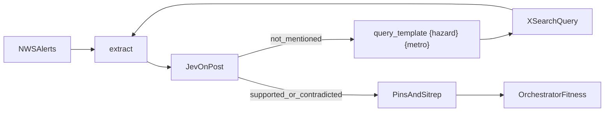

# Plan: Landfall

A watchfloor for one hurricane in one coastal metro. Official alerts, public posts on X, and a static shelter list. Jev checks a social claim before the sitrep quotes it.

Depends on [plan-orchestrator.md](plan-orchestrator.md). Follow [AGENTS.md](../AGENTS.md): one subagent per step, verify, then continue. Do not start this file until the orchestrator "Done when" section is true, and do not build it in parallel with StormCite unless the user says to ship both.

Submissions close **Sep 27, 12:00pm EDT**.

## Lock

One metro. One storm. A historical replay is fine (Helene or Milton). Three layers:

- Official: NWS alerts from `https://api.weather.gov` with a `User-Agent` header. Polygons as GeoJSON.
- Public reports: xAI `x_search` with `from_date`, `to_date`, handle filters (max 20), `enable_image_understanding`, `enable_video_understanding`.
- Places: about 30 shelters and hospitals in `data/places.geojson`.

The scrubber shows pins with `created_at` at or before the cursor.

## Tech

- The orchestrator stack, plus MapLibre GL JS and OSM raster tiles
- Haversine in the Python `math` module
- Matplotlib still of the bbox and pins, then `grok-imagine-video-1.5` image-to-video, about 6 seconds
- Voice tool `list_incidents`
- Keys: `XAI_API_KEY`, `OPENROUTER_API_KEY`

## Incident fields

`id`, `source` (`nws` | `x_post`), `text`, `media_urls[]`, `lat`, `lon` (null if unknown), `hazard` (`flood` | `wind` | `outage` | `shelter` | `other`), `severity` (`low` | `high`), `time`, `jev_label`, `conflict` (bool).

Unknown coordinates stay in an unlocated list. Do not invent a city-center point.

## How Landfall uses the orchestrator playbook

Read the patch contract in [plan-orchestrator.md](plan-orchestrator.md).

`query_template` tokens: `{hazard}`, `{place}`, `{metro}`. Example that should go live: `{hazard} {metro} since {date}`. `xsearch` uses that string as the X Search query. Round 1 without a playbook uses the scenario storm name only, which often yields `not_mentioned` on a flood post. Round 2 with the template finds it.

`prompt_rule` may target `extract` only: "Do not assign lat/lon unless the post names a street, park, or neighborhood in the metro." That rule, once live, should make the unlocated list stable across replays.

A rejected Jev pin is not removed by a patch. Replay of the same scenario must still show that rejected pin. Fitness may rise because rounds dropped, not because the map got cleaner.

Do not call Imagine on a replay if the parent run already stored a video URL. Reuse it.

## Person A — incidents

Owns `services/orchestrator/landfall/**` and `data/scenario.json`, `data/places.geojson`, `data/fixtures/**`. Serial.

### Step L1 — Scenario file

- Subagent: `generalPurpose`
- Files: `data/scenario.json`
- Do: write `metro_name`, `storm_name`, `bbox` as `[west, south, east, north]`, `start`, `end` in ISO-8601, and the NWS zone id you will query.
- Verify: `python -c "import json; d=json.load(open('data/scenario.json')); assert len(d['bbox'])==4"`
- Pass: exits 0.

### Step L2 — Places file

- Subagent: `generalPurpose`
- Files: `data/places.geojson`
- Do: at least 10 Point features inside the bbox, each with `name` and `kind` of `shelter` or `hospital`.
- Verify: `python -c "import json; d=json.load(open('data/places.geojson')); assert len(d['features'])>=10"`
- Pass: exits 0. Every coordinate is inside the bbox. A test in L6 will enforce that.

### Step L3 — NWS client

- Subagent: `tdd-guide`
- Files: `services/orchestrator/landfall/nws.py`, `services/orchestrator/landfall/fixtures/alerts.json`, `services/orchestrator/tests/test_nws.py`
- Do:
  1. Build the alerts URL for the zone in `scenario.json`.
  2. Send `User-Agent`.
  3. Tests load `alerts.json` through a fake transport. No live call in default pytest.
- Verify: `cd services/orchestrator && .venv/bin/pytest tests/test_nws.py -q`
- Pass: exits 0 and the test reads a polygon from the fixture.

### Step L4 — X Search adapter

- Subagent: `tdd-guide`
- Files: `services/orchestrator/landfall/xsearch.py`, `services/orchestrator/tests/test_xsearch.py`, `data/fixtures/x_search.json`
- Do:
  1. Call Responses with tool `x_search`, dates from the scenario, image and video understanding on.
  2. Default test uses a saved JSON body, not the network.
  3. A separate command, run once by the subagent if a key exists, saves a live response to `data/fixtures/x_search.json`. If the key is missing, commit a synthetic fixture of three posts and say so.
- Verify: `pytest tests/test_xsearch.py -q`
- Pass: exits 0. Fixture file has at least one post with text.

### Step L5 — Incident extractor

- Subagent: `tdd-guide`
- Files: `services/orchestrator/landfall/extract.py`, `services/orchestrator/tests/test_landfall_extract.py`
- Do:
  1. Grok returns the incident fields as JSON. Fake the model in tests.
  2. Drop a post that does not name the metro.
  3. Leave `lat` and `lon` null when the text has no specific place. Do not geocode to the city center.
- Verify: `pytest tests/test_landfall_extract.py -q`
- Pass: exits 0. The no-place post is unlocated, not dropped, and not given fake coordinates.

### Step L6 — Jev on incidents

- Subagent: `tdd-guide`
- Files: `services/orchestrator/landfall/judge.py`, `services/orchestrator/tests/test_landfall_judge.py`
- Do:
  1. Two closed questions per post: about this hazard in this metro; text supports the stored severity.
  2. Tests use the orchestrator's fake Jev transport.
  3. A failed post stays in the list with `jev_label=contradicted`.
- Verify: `pytest tests/test_landfall_judge.py -q`
- Pass: exits 0.

### Step L7 — Cluster and conflict

- Subagent: `tdd-guide`
- Files: `services/orchestrator/landfall/cluster.py`, `services/orchestrator/tests/test_cluster.py`
- Do:
  1. Haversine cluster at 1 km, same hazard.
  2. A merge that would change severity is rejected and the pins stay separate.
  3. `conflict=true` when social severity is `high` and the overlapping NWS alert text does not contain that hazard.
- Verify: `pytest tests/test_cluster.py -q`
- Pass: exits 0, including a pair 2 km apart that must not merge.

### Step L8 — Nearest shelter

- Subagent: `tdd-guide`
- Files: `services/orchestrator/landfall/shelter.py`, `services/orchestrator/tests/test_shelter.py`
- Do:
  1. Nearest place by haversine. Return meters and the place name.
  2. Test a known point against `places.geojson`.
  3. The distance is a claim. The sitrep can quote it only after Jev accepts it. In this step, attach the claim; Jev is the shared gate in L9.
- Verify: `pytest tests/test_shelter.py -q`
- Pass: exits 0.

### Step L9 — Sitrep pipeline

- Subagent: `tdd-guide`
- Files: `services/orchestrator/landfall/pipeline.py`, `services/orchestrator/tests/test_landfall_pipeline.py`
- Do:
  1. Run NWS fixture, X fixture, extract, judge, cluster, shelter.
  2. Synthesizer text includes only claims the fake Jev marked supported or contradicted. Contradicted claims appear under "rejected".
  3. Register specialists on the orchestrator allow-list: `nws`, `xsearch`, `extract`, `cluster`, `shelter`.
- Verify: `pytest tests/test_landfall_pipeline.py -q`
- Pass: exits 0. The sitrep string in the test does not contain the word from a claim labeled `not_mentioned`.

### Step L10 — Imagine frame

- Subagent: `generalPurpose`
- Depends on: L9
- Files: `services/orchestrator/landfall/frame.py`, `services/orchestrator/tests/test_frame.py`
- Do:
  1. Matplotlib writes a PNG of the bbox and pins to `data/fixtures/frame.png`.
  2. Call `grok-imagine-video-1.5` only when `final_status` is `passed` or `contradicted` and at least one claim passed. Store the URL on the run.
  3. Test asserts the PNG exists and that a run with zero passed claims does not call Imagine. Fake the video client.
- Verify: `pytest tests/test_frame.py -q`
- Pass: exits 0.

### Step L11 — Incidents webhook

- Subagent: `tdd-guide`
- Files: `services/orchestrator/app.py` (one route), `services/orchestrator/tests/test_incidents_route.py`
- Do: `POST /incidents` accepts the same incident model as the extractor and appends to the latest landfall run. Reject a body that sets `lat` without being inside the bbox.
- Verify: `pytest tests/test_incidents_route.py -q`
- Pass: exits 0.

## Person B — map

Owns `apps/web/app/map/**`. Starts after L9.

### Step M1 — Map page

- Subagent: `generalPurpose`
- Files: `apps/web/app/map/page.tsx`, `apps/web/package.json` if adding `maplibre-gl`
- Do: install `maplibre-gl`. Render an empty map centered on the scenario bbox.
- Verify: `cd apps/web && npx tsc --noEmit`
- Pass: exits 0.

### Step M2 — Three layers

- Subagent: `generalPurpose`
- Files: `apps/web/app/map/layers.ts`
- Do: NWS fill, verified pins, unverified pins, from the run JSON. Different colors, declared in one object.
- Verify: `npx tsc --noEmit`
- Pass: exits 0.

### Step M3 — Time scrubber

- Subagent: `generalPurpose`
- Files: `apps/web/app/map/scrubber.tsx`
- Do: range input from `scenario.start` to `scenario.end`. Pins with a later `time` hide.
- Verify: `npx tsc --noEmit`
- Pass: a fixture with two timestamps hides the later pin when the cursor is in the middle. State that check in the return.

### Step M4 — Pin panel

- Subagent: `generalPurpose`
- Files: `apps/web/app/map/panel.tsx`
- Do: text, evidence span, Jev probability, conflict badge, nearest shelter, link to the post when a URL exists.
- Verify: `npx tsc --noEmit`
- Pass: exits 0.

### Step M5 — Unlocated list

- Subagent: `generalPurpose`
- Files: `apps/web/app/map/unlocated.tsx`
- Do: posts with null coordinates render beside the map, not as pins.
- Verify: `npx tsc --noEmit`
- Pass: the null-coordinate fixture is in the list and absent from the pin array. Say so in the return.

### Step M6 — Imagine panel

- Subagent: `generalPurpose`
- Files: `apps/web/app/map/imagine.tsx`
- Do: show the video URL and the visible text "Generated briefing, not footage." If the URL is missing, say the clip was not generated.
- Verify: `npx tsc --noEmit` and `rg "Generated briefing" apps/web/app/map`
- Pass: both succeed.

### Step M7 — Voice

- Subagent: `generalPurpose`
- Files: `apps/web/app/map/voice.tsx`
- Do: same token flow as StormCite. Tool `list_incidents`. On HTTP 501, label the button "Voice unavailable".
- Verify: `npx tsc --noEmit` and `rg "NEXT_PUBLIC_XAI" apps/web` returns nothing.
- Pass: both true.

### Step M8 — Copy sitrep

- Subagent: `generalPurpose`
- Files: `apps/web/app/map/sitrep.tsx`
- Do: a button copies the sitrep text. Under it, plain links to that metro's emergency management page, 211, and FEMA. The page does not send messages.
- Verify: `npx tsc --noEmit`
- Pass: exits 0. No `fetch` to a 911 or CAD host. `rg "911|cad" apps/web/app/map/sitrep.tsx` should not show an outbound API.

## Done when

The map shows an NWS shape from the fixture, one verified pin, and one rejected pin. The scrubber hides the later pin. The sitrep omits an unsupported number. The video panel either plays a clip labeled generated or says it was not generated.

## Grok Bot

Scheduled, read-only X connector. Search flooding, outages, and shelter posts in the metro since the scenario start. POST the JSON to `/incidents`. Do not post, reply, or like. The stage demo uses the fixture or a direct `x_search` call so a judge does not need the Bot login.

## Demo beat

Start the scenario. Show one pin fail Jev. Show the next round pass after a query patch. Leave unverified pins on the map as unverified. Play the clip only if it exists, with the generated label visible.
