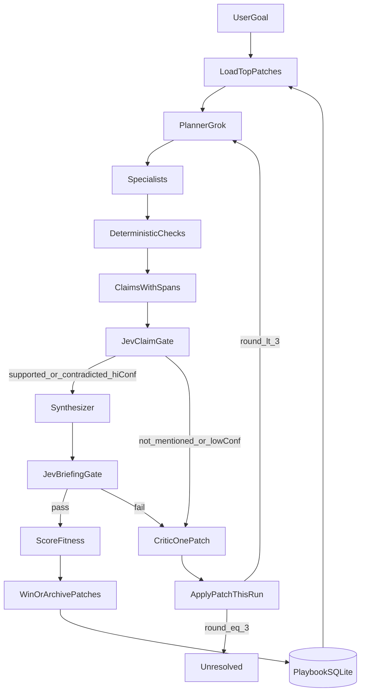
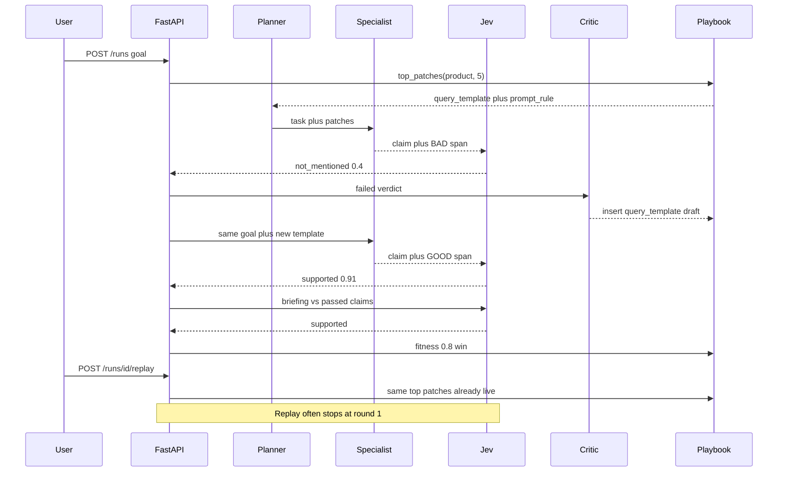

# Plan: shared orchestrator

The loop StormCite and Landfall both call. No map and no PDF screen of its own. Fixture mode proves the loop before either product exists.

Follow [AGENTS.md](../AGENTS.md). One subagent per step. Verify. Then the next step. Build this entire file before [plan-stormcite.md](plan-stormcite.md) or [plan-landfall.md](plan-landfall.md).

Submissions close **Sep 27, 12:00pm EDT**.

## What "recursively improve itself" actually is

The orchestrator does **not** rewrite its Python. That is not allowed, not a demo, and not recursive improvement in this repo.

It improves a **playbook**: a SQLite store of typed patches. A patch changes how the next round, or the next run, asks for evidence. Jev scores whether that change made the run more faithful. Patches that raise fitness stay. Patches that lower fitness are archived. Over time the same goal takes fewer rounds.

There are two clocks.

**Clock 1 — inside one run (rounds).** Round 1 retrieves poorly. Jev says `not_mentioned`. The critic emits one typed patch. Round 2 applies that patch and retrieves again. Jev re-judges. At most 3 rounds. This is the loop a judge sees in ten seconds.

**Clock 2 — across runs (playbook).** When a run ends, every patch used in it gets a win or a loss from a fitness number. The next run for the same product loads the five highest-scoring live patches *before* round 1. A `POST /runs/{id}/replay` starts a second run with the same goal and the updated playbook. The demo of "over time" is: first replay uses 2 rounds, second replay of the same fixture uses 1 round because the winning query template is already loaded.

If fitness does not rise, the new patches are archived and the old playbook is what the next run sees. The system cannot drift toward "say whatever Jev wants."





## Patch contract (what a subagent must implement)

A patch is JSON, not a paragraph. `roles.critic` returns this object. `loop.py` applies it. `playbook.py` stores it. Grok may write `patch_text`. Code writes every other field.

```json
{
  "id": "uuid",
  "product": "stormcite",
  "kind": "query_template",
  "target": "retrieve",
  "trigger": "not_mentioned",
  "body": "{metric} {dataset} results section",
  "patch_text": "Search the results section for the metric and the dataset name.",
  "status": "draft",
  "wins": 0,
  "losses": 0,
  "fitness_ema": 0.0,
  "uses": 0
}
```

**Kinds** the loop knows. Unknown kinds are dropped, not forwarded to Grok.

| kind | What code does on apply | Who uses it |
| --- | --- | --- |
| `query_template` | Format `body` with tokens from the failed claim (`metric`, `dataset`, `citation`, `place`, `hazard`). Pass the string as the specialist query. | StormCite retrieve, Landfall xsearch |
| `prompt_rule` | Append `body` to that specialist's system prompt for this run and later runs while live. Max 200 characters. | extract, synthesizer |
| `span_window` | `body` is `neighbors:1` or `neighbors:2`. The specialist includes that many sentences on each side of the hit. | StormCite support, Landfall judge |
| `retry_guard_block` | Written only by code when the retry-guard Jev check fails. Marks the patch that caused a claim rewrite as `archived`. Never produced by the critic. | loop |

**Statuses:** `draft` (created this run, not yet scored), `live` (fitness rose), `archived` (fitness fell or `losses > 2 * max(wins, 1)` after 3 uses).

**Apply rules:**

1. One new patch per failed round. If three claims failed, the critic picks the first `not_mentioned` claim. It does not emit three patches.
2. A patch never edits `claim.text`. If `claim.text` on round N drops a number that round N-1 had, the retry-guard Jev question runs (`did the claim change to get a pass?`). A `true` / high-noul result archives the patch and keeps the old claim.
3. `prompt_rule` for a specialist not on this product's allow-list is ignored.
4. Templates that do not contain at least one `{token}` from the claim are rejected in code.

## Fitness (how "better" is computed)

After the final Jev gate, `playbook.score_run(run)` writes one row:

```
faithful = n_supported_or_contradicted / max(n_claims, 1)
resolved = 1.0 if final_status != unresolved else 0.0
cheap = 1.0 if rounds == 1 else (0.5 if rounds == 2 else 0.0)
hack = 1.0 if retry_guard_failed else 0.0
fitness = 0.5 * faithful + 0.3 * resolved + 0.2 * cheap - 0.6 * hack
```

A patch used in the run is a **win** when this `fitness` is strictly greater than the previous run's fitness for the same `(product, goal_hash)`, or greater than `0.0` if this is the first run of that goal. Otherwise it is a **loss**.

`fitness_ema` updates as `0.7 * old + 0.3 * fitness` on a win, `0.7 * old + 0.0` on a loss.

`top_patches(product, n=5)` returns `status=live` rows ordered by `fitness_ema desc, wins desc`. Archived rows never load.

The judge-facing proof is the replay table: same goal, run A fitness, run B fitness, rounds A, rounds B. If B is not better, the UI says "playbook held, no promotion." That is a success of the design, not a failure of the demo. The fixture is written so B *is* better (the winning template is known).

## What it does, in order, every run

1. Hash the goal (`sha256` of `product + normalize(goal)`). Load `top_patches` for that product.
2. Planner (Grok Responses, no tools) returns at most **4** specialist names from the product allow-list. Code rejects unknown names. The planner prompt includes the five live `patch_text` lines.
3. Each specialist is called with `(goal, round, patches_for_target)`. It returns claims with spans, or a test marked `not_run`. Empty evidence means no claim is stored.
4. Deterministic checks run (schema, parsers, pytest). Invalid specialist JSON is a failed round, not a looser schema retry.
5. Jev judges each claim against `source_text` (the span or the pytest excerpt, capped).
6. Accept path: `supported` or `contradicted` with confidence at least **0.8**. Else the critic may emit one patch and the loop continues if `round < 3`.
7. Synthesizer writes the briefing from passed claims only. Final Jev sees briefing plus those claims concatenated.
8. Fitness is scored. Draft patches become live or archived. `GET /runs/:id` includes `fitness` and `replay_of`.

Stop at 3 rounds or 40 Jev calls (`unresolved`).

## Jev request the client must send

`POST https://openrouter.ai/api/alpha/decisions`

```json
{
  "model": "typesafe/jev-1.13",
  "state": {
    "claim": "...",
    "source_text": "..."
  },
  "questions": {
    "verdict": {
      "type": "choice",
      "instructions": "How does the source relate to the claim?",
      "criteria": {
        "supported": "Source supports the claim",
        "contradicted": "Source contradicts the claim",
        "not_mentioned": "Source does not mention the claim"
      }
    },
    "confidence": {
      "type": "score",
      "instructions": "Confidence in this verification",
      "criteria": [
        "Low — indirect or partial evidence",
        "Medium — plausible alignment with gaps",
        "High — explicit support or contradiction"
      ]
    }
  }
}
```

Retry-guard question is a separate Decisions call with a noul / yes-no: "Did the new claim drop facts from the previous claim in order to pass?" `state` includes `old_claim` and `new_claim`.

## Tech

- Python 3.12, FastAPI, uvicorn, pydantic v2, httpx, sqlite3, pytest
- Web shell: Next.js App Router, TypeScript, Tailwind
- Grok Responses via `base_url=https://api.x.ai/v1`, model `grok-4.6` or the current id on the xAI docs
- Jev: `POST https://openrouter.ai/api/alpha/decisions` (outside `/api/v1`)
- Keys: `XAI_API_KEY`, `OPENROUTER_API_KEY` in `.env` only

## SQLite

`RUN_DB` path, default `services/orchestrator/playbook.sqlite`, gitignored.

```
runs(id, product, goal, goal_hash, replay_of, round, fitness, final_status, json, created_at)
patches(id, product, kind, target, trigger, body, patch_text, status, wins, losses, fitness_ema, uses, created_at)
patch_events(id, patch_id, run_id, delta_fitness, result)  -- result win|loss
```

## Run JSON extras

Same fields as before, plus:

- `goal_hash`, `replay_of` (nullable run id)
- `fitness` (float)
- `playbook_loaded[]` — the five patches present at round 1
- `playbook_patches[]` — draft / live / archived objects as above

`source_kind` stays an open string. Products define their own.

## APIs

- `POST /runs` `{ "product", "goal", "fixture": false }`
- `GET /runs/:id`
- `POST /runs/:id/replay` — new run, same product and goal, `replay_of` set, playbook already updated
- `GET /playbook?product=` — live patches for the UI
- `GET /health`
- `POST /voice/token` — 501 until a product implements it

## Person A — loop

Owns `services/orchestrator/**` and `packages/schema/run.json`. Serial.

### Step O1 — Project scaffold

- Subagent: `tdd-guide`
- Files: `services/orchestrator/requirements.txt`, `services/orchestrator/app.py`, `services/orchestrator/tests/test_health.py`, `services/orchestrator/pytest.ini`
- Do:
  1. Create the venv and pin fastapi, uvicorn, pydantic, httpx, pytest.
  2. `GET /health` returns `{"ok": true}`.
  3. Test the route with FastAPI's TestClient.
- Verify: `cd services/orchestrator && .venv/bin/pytest tests/test_health.py -q`
- Pass: exits 0.

### Step O2 — Schema and models

- Subagent: `tdd-guide`
- Files: `packages/schema/run.json`, `packages/schema/patch.json`, `services/orchestrator/models.py`, `services/orchestrator/tests/test_models.py`
- Do:
  1. JSON Schema for the run and for the patch object above. pydantic models match field for field.
  2. A test loads a fixture run. A test rejects a missing `evidence_span`.
  3. A test rejects a patch whose `kind` is not in the table.
  4. `source_kind` is a non-empty string, not a closed storm enum.
- Verify: `pytest tests/test_models.py -q`
- Pass: exits 0. After this step, Person B may start W1.

### Step O3 — SQLite store

- Subagent: `tdd-guide`
- Files: `services/orchestrator/store.py`, `services/orchestrator/tests/test_store.py`
- Do:
  1. Create the three tables. Path from `RUN_DB`. Tests use `tmp_path`.
  2. `insert_run`, `get_run`, `save_patch`, `list_live_patches`, `record_event`.
- Verify: `pytest tests/test_store.py -q`
- Pass: exits 0. sqlite file is gitignored.

### Step O4 — Specialist protocol and fixtures

- Subagent: `tdd-guide`
- Files: `services/orchestrator/specialists.py`, `services/orchestrator/fixtures/fail_then_pass.json`, `services/orchestrator/tests/test_specialists.py`
- Do:
  1. A specialist is `(goal, round, patches) -> claims`.
  2. Fixture specialist: if any applied `query_template` `body` contains `{metric}` **or** `round == 2`, return a claim whose span contains `GOOD`. Otherwise the span contains `BAD`.
  3. Unknown specialist names raise.
- Verify: `pytest tests/test_specialists.py -q`
- Pass: exits 0. The same fixture will later prove replay (round 1 succeeds once a live template exists).

### Step O5 — Loop with a fake Jev

- Subagent: `tdd-guide`
- Files: `services/orchestrator/loop.py`, `services/orchestrator/tests/test_loop.py`
- Do:
  1. Fake Jev: span containing `BAD` is `not_mentioned` at 0.4; span containing `GOOD` is `supported` at 0.9.
  2. Loop: specialist, Jev, stop on the accept rule.
  3. Test with no playbook: `round == 2`, `final_status == passed`.
- Verify: `pytest tests/test_loop.py -q`
- Pass: exits 0 with no network.

### Step O6 — Critic emits a typed patch

- Subagent: `tdd-guide`
- Files: `services/orchestrator/roles.py`, `services/orchestrator/tests/test_critic.py`
- Do:
  1. Critic input: failed claim, verdict, product allow-list. Output: one patch object, `kind=query_template`, `target` from the allow-list, `body` containing `{metric}` or `{hazard}`, `status=draft`.
  2. The critic function does not open a file. If Grok is used, a fake client returns the JSON. A fallback in code builds the template from the claim tokens when the model omits `{`.
  3. Test: after round 1, exactly one draft patch. `claim.text` is unchanged.
- Verify: `pytest tests/test_critic.py -q`
- Pass: exits 0.

### Step O7 — Apply and persist playbook

- Subagent: `tdd-guide`
- Files: `services/orchestrator/playbook.py`, `services/orchestrator/tests/test_playbook.py`
- Do:
  1. `apply(patches, specialist_name)` returns the query string and extra prompt lines for that specialist.
  2. `top_patches(product, 5)` returns live rows by `fitness_ema`.
  3. A `query_template` without a `{token}` is not stored.
- Verify: `pytest tests/test_playbook.py -q`
- Pass: exits 0.

### Step O8 — Fitness and win/loss

- Subagent: `tdd-guide`
- Files: `services/orchestrator/fitness.py`, `services/orchestrator/tests/test_fitness.py`
- Do:
  1. Implement the formula exactly. Tests: all supported + 1 round + no hack = 1.0; unresolved + hack = negative or near zero; promotion only when new fitness is strictly greater.
  2. After a win, status becomes `live`. After a loss with `uses >= 3` and `losses > 2 * max(wins, 1)`, status becomes `archived`.
- Verify: `pytest tests/test_fitness.py -q`
- Pass: exits 0.

### Step O9 — Jev HTTP client

- Subagent: `tdd-guide`
- Files: `services/orchestrator/jev.py`, `services/orchestrator/tests/test_jev.py`
- Do:
  1. POST the JSON in this file. Tests use httpx MockTransport: one success, one HTTP 500 that marks that claim `not_run`.
  2. Mark a live-API test `integration` and exclude it from the default run.
  3. Increment `budget.jev_calls`. At 40, `unresolved`.
- Verify: `pytest tests/test_jev.py -q -m "not integration"`
- Pass: exits 0. URL is `https://openrouter.ai/api/alpha/decisions`.

### Step O10 — Retry guard and stop rules

- Subagent: `tdd-guide`
- Files: `services/orchestrator/tests/test_stops.py`, edits to `loop.py` only
- Do:
  1. Confidence 0.5 does not stop.
  2. Round 3 with `not_mentioned` is `unresolved`.
  3. If round 2 claim text drops a number present in round 1, send the retry-guard question. A positive guard archives the patch and keeps the old claim.
- Verify: `pytest tests/test_stops.py -q`
- Pass: exits 0.

### Step O11 — HTTP API including replay

- Subagent: `tdd-guide`
- Files: `services/orchestrator/app.py`, `services/orchestrator/tests/test_api.py`
- Do:
  1. `POST /runs` with `{product, goal, fixture}`. Fixture uses fail-then-pass plus fake Jev.
  2. `GET /runs/{id}` returns the full JSON including `fitness` and `playbook_loaded`.
  3. `POST /runs/{id}/replay` creates a new run with the same goal. After a winning first fixture run, the replay's first specialist call already sees the live `query_template`, so the fake specialist returns `GOOD` on round 1.
  4. `GET /playbook?product=stormcite` lists live patches.
  5. CORS for `http://localhost:3000`. `POST /voice/token` is 501.
- Verify: `pytest tests/test_api.py -q`
- Pass: exits 0. Replay test asserts `rounds == 1` and `fitness` greater than or equal to the parent run.

### Step O12 — Two-run improvement test

- Subagent: `tdd-guide`
- Files: `services/orchestrator/tests/test_improve.py`
- Do:
  1. Run the fixture twice through the loop in process, no HTTP.
  2. Assert run 1 `round == 2`, run 2 `round == 1`, run 2 `fitness >=` run 1 `fitness`, and exactly one `live` `query_template`.
  3. A third test archives a patch: force fitness down (inject `retry_guard_failed`) and assert the patch is not in `top_patches`.
- Verify: `pytest tests/test_improve.py -q`
- Pass: exits 0. This is the contract that "recursive improvement" is real.

### Step O13 — Curl fixture and replay

- Subagent: `generalPurpose`
- Files: `services/orchestrator/README.md` (commands only)
- Do:
  1. Start uvicorn on 8000.
  2. POST fixture, GET it, POST replay, GET playbook.
  3. Paste `final_status`, both `round` values, and both `fitness` values into the return.
- Verify: the two curl POSTs return JSON.
- Pass: first run has a draft-then-live patch and `round` 2. Replay has `round` 1 and a live patch in `playbook_loaded`.

## Person B — shell

Owns `apps/web/**` except product routes, plus `.env.example`. Starts at W1 after O2. Do not edit the schema files.

### Step W1 — Next.js app

- Subagent: `generalPurpose`
- Files: `apps/web/**` from create-next-app
- Do: TypeScript, Tailwind, App Router, no src dir.
- Verify: `cd apps/web && npx tsc --noEmit`
- Pass: exits 0.

### Step W2 — Env example and API helper

- Subagent: `generalPurpose`
- Files: `.env.example`, `apps/web/lib/api.ts`
- Do:
  1. `.env.example` lists `XAI_API_KEY`, `OPENROUTER_API_KEY`, `KAGGLE_USERNAME`, `KAGGLE_KEY`, `ORCHESTRATOR_URL=http://127.0.0.1:8000`.
  2. Helpers: `createRun`, `getRun`, `replayRun`, `getPlaybook`. Keys never go to the browser.
- Verify: `rg "NEXT_PUBLIC_(XAI|OPENROUTER|KAGGLE)" apps/web .env.example` is empty, and `npx tsc --noEmit` exits 0.
- Pass: both true.

### Step W3 — Runs home

- Subagent: `generalPurpose`
- Files: `apps/web/app/page.tsx`
- Do: goal box, product select, fixture checkbox, submit.
- Verify: `npx tsc --noEmit`
- Pass: exits 0.

### Step W4 — Run page layout

- Subagent: `generalPurpose`
- Files: `apps/web/app/runs/[id]/page.tsx`
- Do: goal, product, final status, fitness number, replay-of id if present.
- Verify: `npx tsc --noEmit`
- Pass: exits 0.

### Step W5 — Verdict rows

- Subagent: `generalPurpose`
- Files: `apps/web/app/runs/[id]/claims.tsx`
- Do: claim text, span, Jev label, confidence, test status, where.
- Verify: `npx tsc --noEmit`
- Pass: exits 0.

### Step W6 — Poll

- Subagent: `generalPurpose`
- Files: `apps/web/app/runs/[id]/poll.ts`
- Do: GET every 1s until `final_status` is set or 60s. Show fetch errors.
- Verify: `npx tsc --noEmit`
- Pass: exits 0.

### Step W7 — Round diff and playbook

- Subagent: `generalPurpose`
- Files: `apps/web/app/runs/[id]/diff.tsx`, `apps/web/app/playbook/page.tsx`
- Do:
  1. Between rounds, show `kind`, `body`, and labels that flipped.
  2. Playbook page: live vs archived, `wins`, `losses`, `fitness_ema`.
- Verify: `npx tsc --noEmit`
- Pass: exits 0.

### Step W8 — Replay button

- Subagent: `generalPurpose`
- Depends on: O13 and W7
- Files: `apps/web/app/runs/[id]/page.tsx`
- Do: "Replay with playbook" calls `POST /runs/:id/replay` and navigates to the new id. Show both fitness numbers if `replay_of` is set.
- Verify: parent loads fixture, waits, clicks replay, and records both run ids and both fitness values.
- Pass: those four values are in the subagent return. Replay has fewer rounds or equal rounds with a live patch already loaded.

## Done when

O12, O13, and W8 pass. The browser shows: fail, one typed patch, pass, fitness, replay that loads the patch on round 1. The playbook page shows that patch as live.

## What a later product plugs in

StormCite registers specialists `retrieve`, `extract`, `support`, `provenance`, `resolve`, `numbers`, `kaggle_runner`. It consumes `query_template` and `span_window`.

Landfall registers `nws`, `xsearch`, `extract`, `cluster`, `shelter`. It consumes `query_template` (`{hazard}`, `{place}`) and `prompt_rule` on extract.
