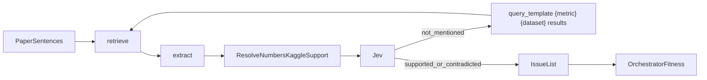

# Plan: StormCite

Superseded. The research product is ArxAudit. Follow [plan-arxaudit.md](plan-arxaudit.md). Person B starts at "Person B" in that file. Person A does not edit `apps/web` or `kaggle/`.

Audit **any** research paper for hallucinated results. Score sections for AI-written vs human-written text using representations learned from a Kaggle corpus. The score sorts the queue. It does not convict the paper.

Depends on [plan-orchestrator.md](plan-orchestrator.md). Follow [AGENTS.md](../AGENTS.md): one subagent per step, verify, then the next step. Submissions close **Sep 27, 12:00pm EDT**.

This replaces the earlier hurricane-only niche. Storms are not the domain. A paper about materials, NLP, medicine, or economics goes through the same checks.

## What "issue" means

An issue is one of these, each with a span and a Jev verdict:

- A citation that Crossref or Semantic Scholar cannot resolve
- A number in the abstract or introduction that the results section does not contain, outside the tolerance below
- A dataset name that does not resolve on the Kaggle dataset API
- A metric claim whose Kaggle rerun log disagrees with the paper, when a rerun is possible
- A claim whose embedding is far from every methods and results sentence (low support)

AI-likeness is a separate column. High AI-likeness plus zero failed checks is "read this first," not "this paper is fake." If the probe's held-out AUC is below **0.60**, hide the column and record why.

## Tech

- Python 3.12, FastAPI, pydantic v2, httpx, pytest, pandas, pyarrow, scikit-learn, joblib
- PDF: **PyMuPDF**. arXiv: `export.arxiv.org` abs and pdf URLs
- Citations: Semantic Scholar Graph API and Crossref `https://api.crossref.org/works`
- Embeddings: **sentence-transformers** `all-MiniLM-L6-v2` (frozen default)
- Contrastive upgrade, only if it wins: `sentence_transformers.losses.MultipleNegativesRankingLoss`, trained one epoch on a Kaggle GPU kernel
- Probe: `sklearn.linear_model.LogisticRegression` on frozen embeddings, trained on a pinned AI-vs-human Kaggle dataset, evaluated with ROC AUC on a held-out split
- Index: **faiss-cpu** over the paper's own sentences
- Claim tests: **pytest** locally and on a Kaggle kernel via the `kaggle` CLI
- Models: Grok Responses (`grok-4.6` or the current id, `base_url=https://api.x.ai/v1`) for extraction and prose. Jev at `POST https://openrouter.ai/api/alpha/decisions` for closed verdicts
- Voice: xAI Voice Agent, tool `get_run`
- Keys: `XAI_API_KEY`, `OPENROUTER_API_KEY`, `KAGGLE_USERNAME`, `KAGGLE_KEY`

## Representation learning, two jobs

**Support encoder.** Embed every sentence. For a claim, the support score is the max cosine to sentences in methods and results. Low support means the paper does not say this near the evidence. Pairs for the optional contrastive tune are `(claim sentence, nearest supporting sentence)` as positives and `(claim sentence, a random sentence from another section)` as negatives. Ship the contrastive encoder only when validation recall@1 beats the frozen MiniLM. Otherwise keep MiniLM and write that decision to `data/models/encoder_choice.json`.

**Provenance probe.** Embed sentences from a Kaggle corpus labeled human vs AI-generated. Fit a logistic regression. Paper inference scores each section. The Kaggle kernel also writes `auc.json` on a held-out split so the detector is tested before the UI trusts it.

Embeddings retrieve and score. They do not replace citation lookups, number checks, or pytest.

## Tolerance

- Integers (sample size, epoch counts): exact after parsing
- Percents and metrics (accuracy, F1, RMSE): relative **5%**
- Money, if a paper has it: relative **5%** after billion/million normalization
- A missing unit is `not_run` for that comparison, not a mismatch

## Kaggle, three kernels

Pin slugs in step S1 by searching. Do not hardcode a slug before that search. Write them in `kaggle/DATASETS.md`.

1. **Probe kernel** `kaggle/probe/`. Downloads the AI-vs-human text dataset, embeds with MiniLM, trains the logistic regression, writes `auc.json` and `probe.joblib`.
2. **Contrastive kernel** `kaggle/contrastive/`. One epoch. Writes `recall.json` and, only on a win, `encoder/`.
3. **Claim kernel** `kaggle/claim_tests/`. Generated `test_claims.py` plus pytest. Runs only for claims that name a dataset slug. Writes `results.json` with `match` | `mismatch` | `missing_row` | `not_run`. Timeout **8 minutes**, then the same tests run locally and the UI label is `local`.

## Demo set

Check in three fixtures under `data/demo/` so judging does not depend on arXiv:

- `human_consistent/` — a short real or excerpted paper whose numbers match its results
- `hallucinated/` — a paper text with one invented citation and one metric that never appears in results
- `ai_section/` — a results section that is AI-generated text stored as a fixture, with a claim that also fails the number check

Expected: the first has no failed checks. The second has a citation issue and a support issue. The third has a high AI-likeness only if AUC ≥ 0.60, plus the failed number check either way.

## Person A — evidence

Owns `services/orchestrator/stormcite/**` and `kaggle/**`. Serial. One subagent per step.

### Step S1 — Pin datasets

- Subagent: `generalPurpose`
- Files: `kaggle/DATASETS.md` only
- Do:
  1. Run `kaggle datasets list -s "ai generated text"` and `kaggle datasets list -s "llm generated"`.
  2. Pick one dataset with a human-vs-AI label column. Record the slug, the label column, and which value means AI.
  3. Pick one public Kaggle dataset a demo paper could claim a metric on (tabular, small, has a documented target). Record the slug and the target column.
  4. Write both slugs, column names, and the exact `kaggle datasets download` commands into `kaggle/DATASETS.md`.
- Verify: `test -s kaggle/DATASETS.md` and `rg -n "slug:" kaggle/DATASETS.md` shows two slugs.
- Pass: another person can download both datasets from that file alone.

### Step S2 — PDF and arXiv ingest

- Subagent: `tdd-guide`
- Files: `services/orchestrator/stormcite/ingest.py`, `services/orchestrator/tests/test_ingest.py`, `data/demo/hallucinated/paper.pdf` or `.txt` if PDF tooling is painful, but prefer a tiny PDF
- Do:
  1. `load_paper(path) -> str` via PyMuPDF.
  2. `load_arxiv(arxiv_id) -> str` downloads the PDF to a temp file and calls `load_paper`.
  3. Tests use the hallucinated fixture. No network in the default test.
- Verify: `cd services/orchestrator && .venv/bin/pytest tests/test_ingest.py -q`
- Pass: test exits 0 and asserts the fixture's title string is in the extracted text.

### Step S3 — Section split

- Subagent: `tdd-guide`
- Files: `services/orchestrator/stormcite/sections.py`, `services/orchestrator/tests/test_sections.py`
- Do:
  1. Split on headings into `abstract`, `introduction`, `methods`, `results`, `references`, `other`.
  2. A paper with no headings becomes one `other` section and sets `section_quality=weak` on the run. Later steps still run.
  3. Tests cover a heading fixture and a no-heading fixture.
- Verify: `pytest tests/test_sections.py -q`
- Pass: both tests exit 0.

### Step S4 — Sentences and the frozen encoder

- Subagent: `tdd-guide`
- Files: `services/orchestrator/stormcite/embed.py`, `services/orchestrator/tests/test_embed.py`
- Do:
  1. Split section text into sentences with a simple regex (period, question mark, exclamation). No new NLP dependency.
  2. `embed_sentences(texts) -> np.ndarray` using MiniLM. Cache by SHA-256 of the text in `data/cache/embeddings/`.
  3. Default test monkeypatches the model with a fake 8-d hasher so CI does not download weights. One test marked `integration` loads the real model.
- Verify: `pytest tests/test_embed.py -q -m "not integration"`
- Pass: exits 0. Vectors for the same sentence match. Two different sentences do not.

### Step S5 — Number and citation parsers

- Subagent: `tdd-guide`
- Files: `services/orchestrator/stormcite/parse.py`, `services/orchestrator/tests/test_parse.py`
- Do:
  1. Parse percents, decimals, integers, and "billion/million".
  2. Parse citation strings: DOI, arXiv id, and a trailing `(Author, Year)` when present.
  3. Tests include `95.2%`, `0.81 F1`, `1.2 billion`, a DOI, and an arXiv id.
- Verify: `pytest tests/test_parse.py -q`
- Pass: exits 0. No model calls in this module.

### Step S6 — Probe on Kaggle

- Subagent: `generalPurpose`
- Depends on: S1, S4
- Files: `kaggle/probe/**`, `data/models/.gitkeep`
- Do:
  1. `kernel-metadata.json`, `enable_gpu: false`, dataset source = the slug from S1.
  2. Script embeds a sample of at most 20,000 rows, fits `LogisticRegression`, writes `auc.json` (`auc`, `n_train`, `n_test`, `positive_label`) and `probe.joblib`.
  3. `kaggle kernels push`, poll up to 20 minutes, `kaggle kernels output` into `data/models/probe/`.
  4. If the queue exceeds 20 minutes, run the same script locally on a 2,000-row sample and set `where=local` inside `auc.json`.
- Verify: `python -c "import json; d=json.load(open('data/models/probe/auc.json')); assert 'auc' in d"`
- Pass: file exists. If `auc < 0.60`, write `data/models/probe/HIDDEN` containing the AUC. Later UI must hide AI-likeness.

### Step S7 — Contrastive support encoder

- Subagent: `generalPurpose`
- Depends on: S4
- Files: `kaggle/contrastive/**`, `data/models/encoder_choice.json`
- Do:
  1. Build pairs from the hallucinated and human fixtures: positive = claim sentence with the results sentence that contains the same number; negative = a sentence from references.
  2. Score frozen MiniLM recall@1 on those pairs. Write it to `recall_frozen.json`.
  3. Push a Kaggle kernel that runs one epoch of `MultipleNegativesRankingLoss` on those pairs plus up to 5,000 sentences from the probe dataset (unlabeled sentences are not used as AI labels here).
  4. Compare recall@1. Write `encoder_choice.json` with `choice: frozen` or `choice: contrastive`.
  5. On timeout, choose frozen and say so in the JSON.
- Verify: `python -c "import json; d=json.load(open('data/models/encoder_choice.json')); assert d['choice'] in ('frozen','contrastive')"`
- Pass: the file records the two recall numbers and the winner.

### Step S8 — Support score

- Subagent: `tdd-guide`
- Depends on: S4, S7
- Files: `services/orchestrator/stormcite/support.py`, `services/orchestrator/tests/test_support.py`
- Do:
  1. Load the encoder named in `encoder_choice.json`.
  2. Build a FAISS index of methods and results sentences for one paper.
  3. `support_score(claim) -> {score, neighbor_text, neighbor_section}`.
  4. Flag `low_support` when score < **0.45**. The threshold is a constant in this file, covered by a test with orthogonal fake vectors (score near 0 flags) and identical vectors (score near 1 does not).
- Verify: `pytest tests/test_support.py -q`
- Pass: exits 0.

### Step S9 — AI-likeness inference

- Subagent: `tdd-guide`
- Depends on: S3, S6
- Files: `services/orchestrator/stormcite/provenance.py`, `services/orchestrator/tests/test_provenance.py`
- Do:
  1. If `data/models/probe/HIDDEN` exists, `score_sections` returns `hidden: true` and no probabilities.
  2. Otherwise load `probe.joblib` and return a probability per section.
  3. Tests use a fake probe that returns 0.9 for any text containing the marker `GENERATED`.
- Verify: `pytest tests/test_provenance.py -q`
- Pass: exits 0, including the hidden-probe case.

### Step S10 — Claim extractor

- Subagent: `tdd-guide`
- Depends on: S3, S5
- Files: `services/orchestrator/stormcite/extract.py`, `services/orchestrator/tests/test_extract.py`
- Do:
  1. Grok Responses returns JSON claims: `text`, `section`, `metric`, `value`, `unit`, `dataset_name`, `citation`.
  2. Drop claims with no number and no citation and no dataset name.
  3. Default test uses a fake Grok client and the hallucinated fixture. Assert the invented citation and the missing metric are both extracted.
- Verify: `pytest tests/test_extract.py -q`
- Pass: exits 0 with no live API key required.

### Step S11 — Citation and dataset resolution

- Subagent: `tdd-guide`
- Depends on: S5, S10
- Files: `services/orchestrator/stormcite/resolve.py`, `services/orchestrator/tests/test_resolve.py`
- Do:
  1. DOI or title lookup on Crossref, then Semantic Scholar. `resolved: true/false`.
  2. Dataset name lookup via `kaggle datasets list -s`. `resolved: true` when a slug's title contains the name.
  3. Tests monkeypatch HTTP. One fake 404 citation, one fake 200, one dataset miss.
- Verify: `pytest tests/test_resolve.py -q`
- Pass: exits 0. A 404 becomes an issue candidate, not an exception.

### Step S12 — Internal number check

- Subagent: `tdd-guide`
- Depends on: S3, S5, S10
- Files: `services/orchestrator/stormcite/numbers.py`, `services/orchestrator/tests/test_numbers.py`
- Do:
  1. For each numeric claim outside results, search results sentences for the same value within tolerance.
  2. Emit `match` or `mismatch` with both spans.
  3. Test the hallucinated fixture: the metric is a mismatch. Test the human fixture: the metric is a match.
- Verify: `pytest tests/test_numbers.py -q`
- Pass: exits 0.

### Step S13 — Claim test generator and local pytest

- Subagent: `tdd-guide`
- Depends on: S1, S10
- Files: `services/orchestrator/stormcite/gen_tests.py`, `kaggle/claim_tests/test_claims.py` (generated, gitignore the generated file, commit a golden sample), `services/orchestrator/tests/test_gen_tests.py`
- Do:
  1. A claim with a `dataset_slug` and a metric becomes one pytest that loads the parquet sample, computes the metric with pandas or a tiny sklearn fit if the claim says accuracy on a named target, and writes `results.json`.
  2. A claim with no public dataset becomes `not_run` with reason `no_public_dataset`. No kernel push.
  3. The test does not assert the paper is true. It records `match` or `mismatch` and the delta.
- Verify: `pytest tests/test_gen_tests.py -q` and `pytest kaggle/claim_tests/test_claims.py -q` against the checked-in sample parquet.
- Pass: both exit 0, and `results.json` contains `where: local` for this step.

### Step S14 — Kaggle claim kernel

- Subagent: `generalPurpose`
- Depends on: S13
- Files: `services/orchestrator/stormcite/kaggle_runner.py`, `kaggle/claim_tests/kernel-metadata.json`, `services/orchestrator/tests/test_kaggle_runner.py`
- Do:
  1. Push, poll 8 minutes, pull output.
  2. Unit test fakes the CLI with a timeout and asserts the runner returns the local log with `where=local`.
  3. One manual run, recorded in the subagent return, pushes the golden test and stores output under `data/fixtures/kaggle_claim_results.json`.
- Verify: `pytest tests/test_kaggle_runner.py -q`
- Pass: exits 0. The fixture JSON exists after the manual push, or the return text says the queue timed out and local was used.

### Step S15 — Wire specialists into the loop

- Subagent: `tdd-guide`
- Depends on: S8 through S14, and orchestrator step O10
- Files: `services/orchestrator/stormcite/pipeline.py`, `services/orchestrator/tests/test_stormcite_pipeline.py`
- Do:
  1. Allow-list: `retrieve`, `extract`, `support`, `provenance`, `resolve`, `numbers`, `kaggle_runner`. `retrieve` is the only target for `query_template`.
  2. Each issue becomes a claim with `evidence_span` and `source_kind` of `paper`, `citation_api`, `kaggle_log`, or `embedding`.
  3. Jev questions, closed: citation resolved or not; number supported by the results span or not; test log supports the claim or not; neighbor span supports the claim or not.
  4. Pipeline test uses fake Jev and fake Grok on the hallucinated fixture. Assert at least one `contradicted` issue and that AI-likeness is absent from the issue list.
  5. When Jev says `not_mentioned` on support, the shared critic emits one `query_template`. The pipeline applies it and calls `retrieve` again. It does not delete a failed citation.
  6. `retrieve` reads `apply(patches, "retrieve")` and uses that string as the FAISS query. If no patch, the query is the paper title.
- Verify: `pytest tests/test_stormcite_pipeline.py -q`
- Pass: exits 0.

### Step S16 — Three-fixture regression

- Subagent: `tdd-guide`
- Depends on: S15
- Files: `services/orchestrator/tests/test_demo_set.py`
- Do:
  1. Run the pipeline on all three demo fixtures with network disabled and fakes only where the real file is missing.
  2. Assert the expected issue counts from the "Demo set" section.
  3. Replay `hallucinated/`: first call `round >= 2`, second call `round == 1`, same citation issue still present, `fitness` not lower.
- Verify: `pytest tests/test_demo_set.py -q`
- Pass: exits 0.

## Person B — audit UI and voice

Owns `apps/web/app/audit/**`. Starts after S15 so the JSON shape is real. Serial.

### Step U1 — Route and empty state

- Subagent: `generalPurpose`
- Files: `apps/web/app/audit/page.tsx`
- Do: page title "StormCite", short line that this checks hallucinated results in any paper, empty state "Pick a demo paper".
- Verify: `cd apps/web && npx tsc --noEmit`
- Pass: tsc exits 0.

### Step U2 — Demo picker and arXiv box

- Subagent: `generalPurpose`
- Files: `apps/web/app/audit/page.tsx`, `apps/web/app/audit/actions.ts`
- Do: three buttons for the demo fixtures, one text input for an arXiv id, submit calls `POST /runs` with `product: stormcite`.
- Verify: `npx tsc --noEmit`
- Pass: tsc exits 0. A code-reviewer checks the arXiv id is not interpolated into a shell command.

### Step U3 — Issue table

- Subagent: `generalPurpose`
- Files: `apps/web/app/audit/issues.tsx`
- Do: columns for issue type, claim text, evidence span, Jev label, confidence, test status, `kaggle` or `local`.
- Verify: `npx tsc --noEmit`
- Pass: a fixture JSON from `test_demo_set` renders five columns. Parent opens the page and confirms, or a small render test does.

### Step U4 — AI-likeness column

- Subagent: `generalPurpose`
- Files: `apps/web/app/audit/provenance.tsx`
- Do: per-section probability bars. If the run says `hidden: true`, render "Probe below 0.60 AUC on the Kaggle holdout. AI-likeness hidden." and no bars.
- Verify: `npx tsc --noEmit` plus a unit check with a hidden fixture and a visible fixture.
- Pass: hidden fixture shows the sentence. Visible fixture shows a number between 0 and 1.

### Step U5 — Support neighbor

- Subagent: `generalPurpose`
- Files: `apps/web/app/audit/support.tsx`
- Do: each low-support issue shows the claim, the nearest sentence, the section name, and the cosine.
- Verify: `npx tsc --noEmit`
- Pass: the hallucinated fixture shows the neighbor text from the run JSON, not a sentence written in the component.

### Step U6 — Kaggle log drawer

- Subagent: `generalPurpose`
- Files: `apps/web/app/audit/log.tsx`
- Do: last 40 lines of pytest output, `where`, kernel URL when present, `not_run` reason when present.
- Verify: `npx tsc --noEmit`
- Pass: timeout fixture shows `local` and the reason.

### Step U7 — Round diff

- Subagent: `generalPurpose`
- Files: `apps/web/app/audit/rounds.tsx`
- Do: show the playbook patch and which issue labels flipped between rounds.
- Verify: `npx tsc --noEmit`
- Pass: a two-round fixture shows one patch string from the API.

### Step U8 — Voice briefing

- Subagent: `generalPurpose`
- Depends on: orchestrator voice token route if it exists; otherwise add `apps/web` call to `POST /voice/token` and stop if the API returns 501, with the button labeled "Voice unavailable"
- Files: `apps/web/app/audit/voice.tsx`, and `services/orchestrator/voice.py` only if Person A is not editing the orchestrator in parallel. If they are, skip the Python file and leave the button on 501.
- Do: Voice Agent tool `get_run`. System text: speak issues that Jev marked supported or contradicted; say "not run" when that is the status; do not say a paper is fraudulent; do not quote AI-likeness as proof.
- Verify: `npx tsc --noEmit`. Parent clicks the button on the fixture run.
- Pass: the button either connects or shows the 501 label. It never reads the API key in the browser bundle (`rg NEXT_PUBLIC_XAI apps/web` returns nothing).

## Done when

The hallucinated demo shows a failed citation or a failed number check, with the evidence span and a Jev label. The human demo does not show that same failure. AI-likeness is either a probability with the holdout AUC visible, or hidden because AUC < 0.60. At least one claim test log is on screen as `kaggle` or `local`. Voice, if connected, does not call the paper a fraud.

## Grok Bot

Read-only scheduled job. Search X for posts that share a new paper PDF or arXiv link about AI-written papers. `POST /queue` with the URL. Do not post a verdict.

## How StormCite uses the orchestrator playbook

Read the patch contract in [plan-orchestrator.md](plan-orchestrator.md). StormCite does not invent a second memory.

Tokens the critic may put in a `query_template` `body`: `{metric}`, `{dataset}`, `{citation}`, `{section}`. Example that should go live after the hallucinated demo: `{metric} {dataset} results`. Round 2 embeds that string and searches methods plus results only.

`span_window` of `neighbors:1` is the second allowed kind. It fires when support cosine is below 0.45 but Jev says `not_mentioned` on the neighbor (the wrong sentence was retrieved). Code then includes one sentence on each side before re-embedding.

`prompt_rule` may target `extract` only, and only to add "drop claims that have no number, citation, or dataset." It may not tell extract to skip citations.

A failed citation is never "fixed" by a patch. Resolution is an HTTP 200 or 404. The critic does not get that verdict.

Do not push a Kaggle kernel again when `results.json` already exists for that claim id. Replay of the same paper should skip S14 and show the stored log.

Replay demo: first audit of `hallucinated/` takes two rounds (title query misses the metric). After fitness promotes the template, `POST /runs/{id}/replay` finishes in one round with the same issues. The issue list must not shrink. If replay drops a citation issue, the retry-guard path should have archived that patch. Add this assert to S16.

