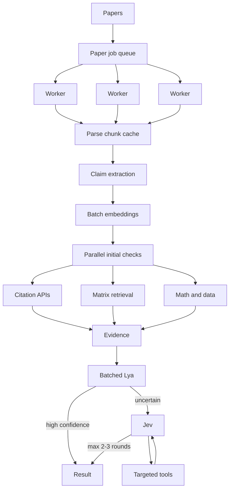
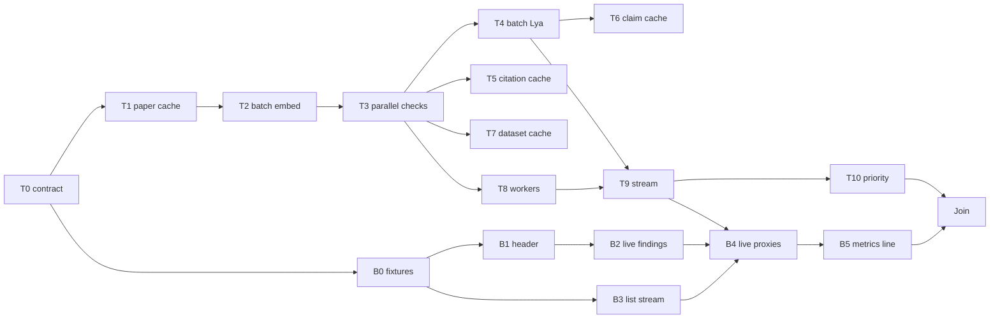

# High-throughput verification

Source brief: `/Users/sohaibqurashi/Documents/ArxAudit_High_Throughput_Architecture.md`. Current desk: [docs/technical-state.md](technical-state.md). Screen words: [docs/plan-author-chat.md](plan-author-chat.md) and [docs/demo-script.md](demo-script.md).

The chair desk, the author thread, Lya-then-Jev, and the fixture papers stay. This plan makes the same read fast for one paper and able to run many papers at once. Compute should grow with how hard a claim is, not with how many papers sit in the list.

```text
Batch what is repetitive. Parallelize what is independent.
Cache what is reusable. Escalate only what is uncertain.
```

Follow [AGENTS.md](../AGENTS.md): one subagent per step, verify, then continue. Person A does not edit `apps/web`. Person B does not edit `services/orchestrator`. Two steps run at once only when both say parallel-ok and their file lists do not overlap.

Do not start Landfall. Do not retrain Lya. Do not raise `LYA_THRESHOLD`. Do not send every claim to Jev. Do not say fake, fraudulent, fabricated, or AI-written.

## What already exists

Do not rebuild these. The new work sits on top of them.

- One paper is parsed once per audit in [services/orchestrator/paper_audit.py](../services/orchestrator/paper_audit.py). Stages still run in a fixed order: parse, claims, evidence, citations, numbers, tables, dataset, reproduce, verify, critic, stamp.
- Claims inside one stage can already share a small thread pool (`_map_claims`). The stages themselves wait for each other. Citations, retrieval, and math are not started together.
- Evidence lives in [services/orchestrator/evidence.py](../services/orchestrator/evidence.py). Chunks are embedded one text at a time. A cosine helper exists. Live desk usually falls back to hash overlap because MiniLM is not in the orchestrator venv.
- Fine-tuned Lya judges one claim at a time in [services/orchestrator/lya.py](../services/orchestrator/lya.py) and [services/orchestrator/lya_local.py](../services/orchestrator/lya_local.py). `mlx_lm.generate` is one prompt. There is already a per-claim Lya cache keyed by claim text, evidence, and model.
- Verify is already Lya first, Jev only under 0.90, at most three tool rounds, in [services/orchestrator/verify.py](../services/orchestrator/verify.py). A finished number contradiction, table formula, or rerun stays final. Do not change that lock.
- Catalog lookups are in [services/orchestrator/catalogs.py](../services/orchestrator/catalogs.py). Crossref, OpenAlex, and Semantic Scholar are asked per citation. There is no conference-wide DOI cache.
- The conference drain in [services/orchestrator/desk.py](../services/orchestrator/desk.py) (`start_run` → `_drain`) reads one queued paper after another on one thread. Paper 2 waits for paper 1.
- The screen polls. Findings appear after the paper stamps. The list does not show a live count of finished papers while others still run.

## Shared contract

Person A writes these shapes. Person B builds the screen against them, with fixtures under `apps/web/app/desk/fixtures/` until the live routes exist. Field names freeze after step T0.

### Paper progress (`GET /desk/papers/{job_id}` already returns the paper)

Add these fields. Older clients ignore them.

- `progress`: `{parsed: bool, claims_total: int, claims_done: int, findings_so_far: int, lya_done: int, jev_running: int, phase: "parse"|"checks"|"lya"|"jev"|"done"}`
- A claim may appear on the paper as soon as it has a verdict. A later deeper check may replace `insufficient_evidence` with a settled verdict. It may not replace a deterministic `contradicted`, `could_not_reproduce`, or `reproduced`.

### Conference progress (`GET /desk/conferences/{id}`)

Add:

- `progress`: `{papers_total: int, papers_done: int, papers_with_findings: int, papers_running: int, papers_queued: int}`

### Throughput metrics (`GET /desk/metrics?conference_id=`)

Response:

```json
{
  "conference_id": "...",
  "papers": 0,
  "claims": 0,
  "resolved_deterministic": 0,
  "resolved_lya": 0,
  "escalated_jev": 0,
  "avg_jev_rounds": 0,
  "citation_cache_hits": 0,
  "citation_cache_misses": 0,
  "paper_cache_hits": 0,
  "paper_cache_misses": 0,
  "lya_batches": 0,
  "claims_per_lya_batch": 0,
  "time_to_first_finding_ms": null,
  "median_paper_ms": null
}
```

No `conference_id` on author routes. Author papers still use the existing `/author/papers` shapes. The author shelf may reuse the paper cache and the citation cache; it does not get a second worker pool.

## Architecture



## Who builds what

- **Person A — loop and caches.** `services/orchestrator/**`, `docs/plan-throughput.md` only when a contract line must change. Does not edit `apps/web`.
- **Person B — live desk.** `apps/web/app/desk/**`, `apps/web/app/api/desk/**`, `apps/web/lib/desk.ts`, `apps/web/lib/verdict.ts`. Does not edit the orchestrator. Does not edit `apps/web/app/author/**` or `apps/web/app/desk/[id]/ask.tsx`.

## Rules that still bind

- Deterministic number, table, and rerun verdicts stay final. Lya and Jev do not overwrite them.
- Lya threshold stays 0.90. Jev runs only when Lya does not accept. Max two tools, three rounds, then `insufficient_evidence`.
- A catalog error stays `not_checked`. Unresolved is only when all three catalogs answer and none match.
- Issues still come from a failed citation, a number missing from the results, an unsupported claim, an unresolved dataset, or a failed public-table rerun. Likeness is never a finding.
- Public data only. Keys stay server-side. Never `NEXT_PUBLIC_` for `XAI_API_KEY`, `OPENROUTER_API_KEY`, `KAGGLE_KEY`, or Supabase service role.
- Copy never says fake, fraudulent, fabricated, or AI-written.
- Agents do not edit their own source to make a run pass.
- One chair list. `create_user_conference` still returns 409. Author shelves stay off `/desk`.
- Confirm-email stays on.

## Person A — API

### T0 — Freeze the progress and metrics contract

- Subagent: `generalPurpose`
- Files: [docs/plan-throughput.md](plan-throughput.md) (this file, contract section only if a name must be fixed), [apps/web](../apps/web) is off limits, [services/orchestrator/models.py](../services/orchestrator/models.py) (add the TypedDict / dataclass names only), [services/orchestrator/tests/test_throughput_contract.py](../services/orchestrator/tests/test_throughput_contract.py) (new).
- Do:
  1. Add `PaperProgress`, `ConferenceProgress`, and `ThroughputMetrics` in `models.py` matching the Shared contract.
  2. A unit test that builds each object and checks the frozen field names. No audit, no network.
- Verify: `services/orchestrator/.venv/bin/python -m pytest tests/test_throughput_contract.py -q`
- Pass: exits 0.
- Parallel-ok with every Person B step after B0.

### T1 — Paper-hash cache

- Subagent: `generalPurpose`
- Depends on: T0
- Files: [services/orchestrator/paper_cache.py](../services/orchestrator/paper_cache.py) (new), [services/orchestrator/paper_audit.py](../services/orchestrator/paper_audit.py) (parse and section read only), [services/orchestrator/tests/test_paper_cache.py](../services/orchestrator/tests/test_paper_cache.py) (new).
- Do:
  1. Hash the PDF bytes. Store parsed text, sections, page count, extracted tables, and extracted references under that hash in SQLite (`paper_artifacts`). Gitignored DB, same `RUN_DB`.
  2. `audit_paper` loads the cache on a second read of the same bytes and skips PyMuPDF.
  3. A changed PDF is a new hash and a new parse.
  4. Tests use `fixtures/human.pdf` twice. Second call does not open the file again (patch the loader and assert it was not called).
- Verify: `services/orchestrator/.venv/bin/python -m pytest tests/test_paper_cache.py -q`
- Pass: exits 0. First fixture paper still extracts the same abstract text.
- Parallel-ok with B1.

### T2 — Batch embeddings and matrix retrieval

- Subagent: `generalPurpose`
- Depends on: T1
- Files: [services/orchestrator/evidence.py](../services/orchestrator/evidence.py), [services/orchestrator/tests/test_evidence.py](../services/orchestrator/tests/test_evidence.py).
- Do:
  1. Embed all paper chunks in one call when the embedder can take a list. Hash fallback still embeds in a list comprehension, not a per-claim loop.
  2. Store the chunk matrix on `PaperIndex` and, when present, on the paper-hash cache (do not store MiniLM weights).
  3. Embed all claim texts in one batch. Build one `[C × N]` similarity matrix. Attach support and contradict rows from that matrix. Neighbors (`around`, n=6) still merge into the first-pass evidence.
  4. `ARX_EMBEDDER=hash` stays the default test path. Overlap rank stays when MiniLM failed.
  5. Add `test_one_matrix_covers_every_claim`. Do not download torch.
- Verify: `services/orchestrator/.venv/bin/python -m pytest tests/test_evidence.py -q`
- Pass: exits 0. Existing neighbor and heading tests still pass.
- Parallel-ok with B1, B2.

### T3 — Parallel initial checks

- Subagent: `generalPurpose`
- Depends on: T2
- Files: [services/orchestrator/paper_audit.py](../services/orchestrator/paper_audit.py), [services/orchestrator/tests/test_paper_audit.py](../services/orchestrator/tests/test_paper_audit.py) (add cases; do not rewrite the file).
- Do:
  1. After claims exist, start citations, evidence attach, numbers, and tables together. Dataset/reproduce may start as soon as claims exist; they do not wait for Lya.
  2. Parse still happens first. Verify still happens after those checks write evidence and deterministic verdicts.
  3. Stamp still happens last.
  4. Test: a fixture paper with a number miss and a table miss still records both, and the test patches the four check functions to prove they were entered before any of them returned (use a barrier or start-time stamps).
- Verify: `services/orchestrator/.venv/bin/python -m pytest tests/test_paper_audit.py tests/test_claims.py -q`
- Pass: exits 0. 95.2 and 7.8 still contradicted on the demo fixture when those tests already cover them.
- Parallel-ok with B2.

### T4 — Batch Lya

- Subagent: `generalPurpose`
- Depends on: T3
- Files: [services/orchestrator/lya_local.py](../services/orchestrator/lya_local.py), [services/orchestrator/lya.py](../services/orchestrator/lya.py), [services/orchestrator/verify.py](../services/orchestrator/verify.py), [services/orchestrator/tests/test_lya.py](../services/orchestrator/tests/test_lya.py) (or a new `tests/test_lya_batch.py` if that file is huge).
- Do:
  1. Add `generate_many(path, system, users: list[str]) -> list[str]`. If `mlx_lm` can batch, use it. If not, run the list under one loaded model without reloading weights. Do not call `load()` per claim.
  2. `lya.judge_claims(pairs) -> list[dict]` uses the cache first, then one `generate_many` for the misses.
  3. Verify collects every non-final numerical/semantic claim, calls `judge_claims` once, then runs Jev only on the rows `accepts()` rejects.
  4. Test with a fake `generate_many` that records the batch size. Two uncached claims become one call. A cached claim is not in that call. Deterministic-final claims are not sent.
- Verify: `services/orchestrator/.venv/bin/python -m pytest tests/test_lya.py tests/test_verify.py -q` (include `tests/test_lya_batch.py` if created)
- Pass: exits 0. Lya threshold still 0.90. Jev still absent when Lya accepts.
- Parallel-ok with B2, B3.

### T5 — Global citation cache and parallel catalog calls

- Subagent: `generalPurpose`
- Depends on: T3
- Files: [services/orchestrator/catalogs.py](../services/orchestrator/catalogs.py), [services/orchestrator/references.py](../services/orchestrator/references.py), [services/orchestrator/tests/test_catalogs.py](../services/orchestrator/tests/test_catalogs.py).
- Do:
  1. Cache key is DOI when present, else `normalized_title + authors + year`. Store status, candidate title, and doi in SQLite (`citation_cache`).
  2. A second paper that cites the same work does not HTTP the catalogs.
  3. The three catalogs for one citation already can be concurrent; make sure they are. Separate citations in one paper run concurrently with a small cap (4).
  4. A cached `error` is not reused forever: retry once per process start, then keep `not_checked`.
  5. Test: two claims with the same DOI hit the transport once.
- Verify: `services/orchestrator/.venv/bin/python -m pytest tests/test_catalogs.py -q`
- Pass: exits 0. Vaswani fixture still matches when the fake transport returns a hit. Smith 2099 still unmatched when the transport returns none.
- Parallel-ok with T4 and with B3.

### T6 — Claim-level retrieval and judge cache

- Subagent: `generalPurpose`
- Depends on: T4
- Files: [services/orchestrator/evidence.py](../services/orchestrator/evidence.py), [services/orchestrator/lya.py](../services/orchestrator/lya.py), [services/orchestrator/jev.py](../services/orchestrator/jev.py), [services/orchestrator/tests/test_claim_cache.py](../services/orchestrator/tests/test_claim_cache.py) (new).
- Do:
  1. Cache retrieval rows on `paper_hash + claim_hash`.
  2. Keep the existing Lya cache. Key must include adapter identity (`local` plus the adapter file mtime or a version string in `lya_adapter`).
  3. Cache a finished Jev judgment on `claim_hash + evidence_hash + jev_version`. Do not cache a transport error as a verdict.
  4. Tests use hash embedder and a fake Jev.
- Verify: `services/orchestrator/.venv/bin/python -m pytest tests/test_claim_cache.py tests/test_lya.py -q`
- Pass: exits 0.
- Serial with T4. Parallel-ok with B3, B4.

### T7 — Dataset cache

- Subagent: `generalPurpose`
- Depends on: T3
- Files: [services/orchestrator/repro.py](../services/orchestrator/repro.py), [services/orchestrator/datasets.py](../services/orchestrator/datasets.py), [services/orchestrator/tests/test_datasets.py](../services/orchestrator/tests/test_datasets.py).
- Do:
  1. After a public table is resolved or downloaded, store the local path and the identifier (Kaggle slug or name).
  2. A second claim or a second paper that names the same table reuses the file. Do not download twice in one test.
  3. Restricted DSL stays: `rows`, `sum`, `mean`, `count_eq` only. No model-written Python.
- Verify: `services/orchestrator/.venv/bin/python -m pytest tests/test_datasets.py tests/test_repro.py -q`
- Pass: exits 0. Titanic 342 still reproduces, 317 still 216.
- Parallel-ok with T5, T6, B3.

### T8 — Paper worker pool

- Subagent: `generalPurpose`
- Depends on: T3
- Files: [services/orchestrator/desk.py](../services/orchestrator/desk.py) (`start_run`, `_drain`, `_audit_job` only), [services/orchestrator/tests/test_desk.py](../services/orchestrator/tests/test_desk.py).
- Do:
  1. `_drain` runs up to `DESK_WORKERS` papers at once (default 2, cap 8). One slow paper does not block the next queued paper.
  2. A conference still has one drain thread that hands jobs to the pool. Two `start_run` calls on the same conference still no-op while that drain is alive.
  3. Author `start_run` uses the same pool.
  4. Test: three queued fixtures, `DESK_WORKERS=2`, assert the second job reaches `running` before the first hits `passed` or `contradicted` (use a latch on `_audit_job` or a slow parse monkeypatch).
- Verify: `services/orchestrator/.venv/bin/python -m pytest tests/test_desk.py tests/test_author.py -q`
- Pass: exits 0. Chair list still returns only the demo conference. Author shelves stay hidden.
- Parallel-ok with T5–T7 and B4.

### T9 — Stream claim verdicts and conference progress

- Subagent: `generalPurpose`
- Depends on: T4, T8
- Files: [services/orchestrator/paper_audit.py](../services/orchestrator/paper_audit.py) (write progress after each phase), [services/orchestrator/desk.py](../services/orchestrator/desk.py) (`paper_desk`, `conference_desk`), [services/orchestrator/app.py](../services/orchestrator/app.py) (GET `/desk/metrics` only), [services/orchestrator/tests/test_progress.py](../services/orchestrator/tests/test_progress.py) (new).
- Do:
  1. After deterministic checks, persist claims that already have a final verdict so `GET /desk/papers/{id}` can return them while Lya/Jev still run.
  2. Fill `progress` on the paper and on the conference.
  3. Implement `GET /desk/metrics?conference_id=` from the Shared contract. Numbers come from the same SQLite. No secrets in the payload.
  4. Time to first finding is the first persisted finding on that conference, in milliseconds from `start_run`.
  5. Test with `0000.00001`: after numbers, the 95.2 claim is already on the paper while verify is patched to sleep. Conference progress shows `papers_running >= 1`.
- Verify: `services/orchestrator/.venv/bin/python -m pytest tests/test_progress.py -q`
- Pass: exits 0.
- Serial with T4 and T8. Person B step B4 waits for this.

### T10 — Priority and metrics honesty

- Subagent: `generalPurpose`
- Depends on: T9
- Files: [services/orchestrator/verify.py](../services/orchestrator/verify.py), [services/orchestrator/desk.py](../services/orchestrator/desk.py) (queue order only), [services/orchestrator/tests/test_priority.py](../services/orchestrator/tests/test_priority.py) (new).
- Do:
  1. Jev order inside one paper: contradicted-looking rows and unresolved citations first, then the rest of the uncertain set.
  2. Across papers, a paper that already has a deterministic finding is not starved; workers still take the next queued paper. Do not add a misconduct flag.
  3. Metrics increment `resolved_deterministic`, `resolved_lya`, `escalated_jev` from stored steps, not from guesses.
  4. Test: two uncertain claims, one with a number miss already stored, Jev is called on that one first (fake Jev records order).
- Verify: `services/orchestrator/.venv/bin/python -m pytest tests/test_priority.py tests/test_progress.py -q`
- Pass: exits 0.
- Parallel-ok with B4, B5.

## Person B — screen

### B0 — Fixture shapes

- Subagent: `generalPurpose`
- Files: [apps/web/app/desk/fixtures/progress.json](../apps/web/app/desk/fixtures/progress.json) (new), [apps/web/lib/desk.ts](../apps/web/lib/desk.ts) (types only).
- Do:
  1. Copy `progress` and `metrics` from the Shared contract into the fixture and into `Paper`, `ConferenceDesk`, and a `ThroughputMetrics` type.
  2. Do not call the API. Do not change ask or author.
- Verify: `node apps/web/node_modules/typescript/bin/tsc --noEmit --pretty false -p apps/web/tsconfig.json` — zero errors outside `apps/web/.next`.
- Pass: types compile. Parallel-ok with T0 and every later Person A step until B4.

### B1 — Live paper header

- Subagent: `generalPurpose`
- Depends on: B0
- Files: [apps/web/app/desk/[id]/[jobId]/workflow.tsx](../apps/web/app/desk/[id]/[jobId]/workflow.tsx), [apps/web/lib/verdict.ts](../apps/web/lib/verdict.ts) (one helper if needed).
- Do:
  1. While `status` is `running`, the line under the title uses `progress`: “12 of 40 claims checked. 2 to open.” not a wall of category fractions.
  2. When `findings_so_far > 0` before the paper stamps, show that count. Do not wait for `contradicted`.
  3. Poll stays. Do not add websockets in this step.
  4. Cream, ink, gold, rust, Newsreader, IBM Plex Sans. No framer-motion.
- Verify: tsc as in B0. Parent opens a running fixture (or the fixture paper with `progress` injected) and records the header sentence.
- Pass: header names counts, not “SPECIALISTS”. Parallel-ok with T1–T4.

### B2 — Findings appear before the stamp

- Subagent: `generalPurpose`
- Depends on: B1
- Files: [apps/web/app/desk/specialists.tsx](../apps/web/app/desk/specialists.tsx), [apps/web/app/desk/finding.tsx](../apps/web/app/desk/finding.tsx).
- Do:
  1. The right rail already groups To check / Needs a person / Holds / Not checked. Keep that.
  2. If the paper is still running and a claim already has a verdict, show it in the matching group. Do not hide the queue until stamp.
  3. `How this was read` stays closed.
  4. A claim that later moves from Needs a person to To check (Jev finished) updates in place on the next poll.
- Verify: tsc. Parent looks at Adaptive Reasoning Systems while a patched progress fixture says `phase: "jev"` and one contradicted claim is present.
- Pass: the 95.2 card is visible before `phase` is `done`. Parallel-ok with T3–T7.

### B3 — Conference list streams

- Subagent: `generalPurpose`
- Depends on: B0
- Files: [apps/web/app/desk/progress.tsx](../apps/web/app/desk/progress.tsx), [apps/web/app/desk/rail.tsx](../apps/web/app/desk/rail.tsx), [apps/web/app/desk/[id]/page.tsx](../apps/web/app/desk/[id]/page.tsx).
- Do:
  1. The list page shows `247 complete · 31 with findings · 722 running` from `conference.progress` when those fields exist.
  2. A finished paper stays clickable while others run.
  3. Do not add a conference picker. One list.
  4. Poll the conference about every 2 seconds while `papers_running + papers_queued > 0`.
- Verify: tsc. Parent records the three counts from a fixture desk.
- Pass: a Verified paper is openable while another row still says Running. Parallel-ok with T5–T8.

### B4 — Point the screen at live progress

- Subagent: `generalPurpose`
- Depends on: B2, B3, T9
- Files: [apps/web/app/api/desk/conferences/[id]/route.ts](../apps/web/app/api/desk/conferences/[id]/route.ts) (pass through new fields), [apps/web/app/api/desk/papers/[jobId]/route.ts](../apps/web/app/api/desk/papers/[jobId]/route.ts), [apps/web/app/api/desk/metrics/route.ts](../apps/web/app/api/desk/metrics/route.ts) (new, auth same as other desk proxies).
- Do:
  1. Proxies forward `progress` and expose `GET /api/desk/metrics?conference_id=`. Owner comes from the session. Keys stay on the server.
  2. Drop fixture-only progress once the live paper returns the fields.
- Verify: tsc, then signed-in `/desk` still the one list. Open Adaptive Reasoning Systems. Confirm the header and the To check list match the live paper.
- Pass: parent writes the live header sentence and the first To check line.
- Serial with T9.

### B5 — Throughput line on the list

- Subagent: `generalPurpose`
- Depends on: B4
- Files: [apps/web/app/desk/progress.tsx](../apps/web/app/desk/progress.tsx), optional slim block on [apps/web/app/desk/[id]/page.tsx](../apps/web/app/desk/[id]/page.tsx).
- Do:
  1. One quiet line under the list counts: “Lya settled N · Jev opened M · citation cache hit P%”. Numbers from `/api/desk/metrics`.
  2. Hide the line when every count is zero (fresh list).
  3. Do not show a trust score.
- Verify: tsc. Parent records the line after a finished demo conference.
- Pass: the line uses the three metric names above. Parallel-ok with T10.

## Join

After T10 and B5:

1. Person A starts the three fixture papers on the demo conference with `DESK_WORKERS=2`.
2. Person B watches the list: a finding appears on `0000.00001` before `0000.00002` finishes.
3. Open Adaptive Reasoning Systems. 95.2, 7.8, 317, and 342 still read the same as [docs/demo-script.md](demo-script.md).
4. Record from `GET /desk/metrics`: papers, `resolved_deterministic`, `resolved_lya`, `escalated_jev`, citation cache hits, time to first finding.
5. `/author` still asks one paper. `/desk` still shows one conference named Sohaib.

That is the only step that needs both people finished.

## Build order



1. T0. Then T1 and B0 together.
2. T2, then T3. B1 can run beside T2.
3. After T3: T4, T5, T7, T8, and B2/B3 may run as long as file lists do not overlap. T4 and T5 both touch different files; they are parallel-ok. T4 and T6 are serial.
4. T9 after T4 and T8. B4 after T9, B2, and B3.
5. T10 and B5. Then Join.

Do not hand a subagent this whole file. One step, one file list, one verify command.

## Done when

- The same PDF parsed twice hits the paper cache.
- One paper embeds chunks once and claims once, then retrieves with a matrix.
- Citations, retrieval, numbers, and tables start together after claims exist.
- Lya is one batch per paper (plus cache hits), not one model load per claim.
- Jev still runs only on uncertain claims, at most three rounds.
- Two papers in one conference can be `running` at the same time when `DESK_WORKERS >= 2`.
- A deterministic finding is visible on the paper before stamp.
- The chair list updates complete / with findings / running while the rest of the queue works.
- `0000.00001` still fails, `0000.00002` still Verified, Adaptive Reasoning Systems still shows 95.2, 7.8, 317 vs 216, and 342 reproduced.
- Metrics report deterministic vs Lya vs Jev without a single trust score.
- Author chat and the one chair list still work.

## What not to do

- One claim through parse → Lya → Jev before the next claim starts.
- One paper through the whole audit before the next paper may start, once T8 has landed.
- Jev on every claim.
- Re-embed a paper whose bytes have not changed.
- Re-query Crossref for a DOI the conference already resolved.
- Wait for stamp before the chair can open a finding.
- A numeric “trust the paper” score.
- Resource-aware GPU/CPU pools and adaptive batch sizing. Those are P2. Do them only after Join, as later steps T11 (separate CPU/network/Jev pools) and T12 (batch size from queue depth). Do not start them in this file’s Join.

## Later, after Join (not this build)

T11 — split CPU parse, network catalogs, and Jev into separate pools.  
T12 — adaptive Lya batch size from queue depth.  
T13 — evidence recall@k and Lya calibration numbers on `/desk/metrics`.

Do not open those until the Done when section above is true.
