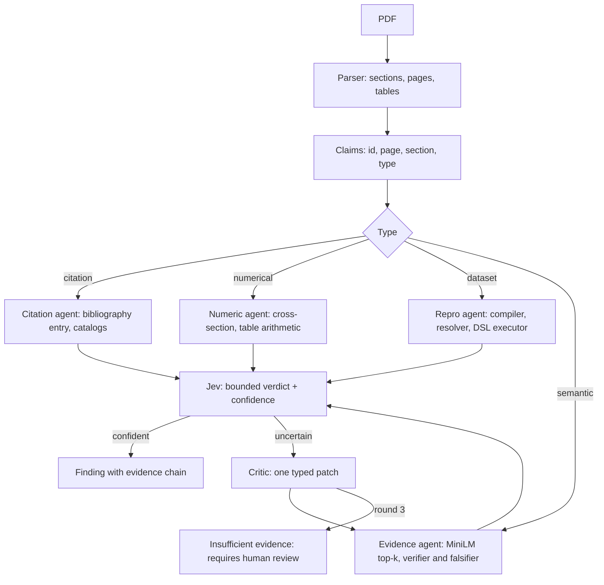

# ArxAudit verification build plan

Source brief: `/Users/sohaibqurashi/Documents/ArxAudit_Complete_Product_Technical_Build_Brief.md`. Current state: [docs/technical-state.md](docs/technical-state.md). On approval this plan is saved as [docs/plan-verification.md](docs/plan-verification.md) so both people work from the repo copy.

Deadline: Sep 27, 12:00pm EDT. Each step is 1–2 hours. Do them in order. Do not commit until the user says so.

## What changes and what stays

**Stays.** Next.js desk at `/desk`, Supabase auth, FastAPI checker, SQLite desk DB, pdf.js viewer with text-layer highlight, arXiv id intake, the two fixtures, Grok for chat prose, the playbook modules (`store.py`, `fitness.py`, `roles.py`, `playbook.py`, `loop.py`), the word rules (no fraud, no AI-written, likeness is never a finding).

**Changes, per the brief.**
- Claims become first-class rows with id, page, section, type. Today `_extract_claims` in [services/orchestrator/paper_audit.py](services/orchestrator/paper_audit.py) returns untyped dicts and only failures are stored.
- Support goes from word overlap (`_support_issues`) to MiniLM embeddings + NumPy cosine top-k, per section.
- Jev runs on the desk. Today `desk._audit_job` calls `audit_paper` and the `jev` stage only stamps `contradicted`. Real `jev.judge_claim` is only on the old batch path.
- Resolve checks the reference against Crossref, OpenAlex, Semantic Scholar. Today it only checks the PDF's own bibliography.
- Low-confidence verdicts recurse through the existing critic/`playbook.apply`/`MAX_ROUNDS = 3` loop, ending in "Requires human review".
- Numbers gains table parsing and derived arithmetic (difference, percent change).
- Rerun becomes: claim compiler → dataset resolver → Kaggle download → local pandas over a restricted DSL. Today `repro.py` uses stdlib csv with 4 ops and a kernel push.
- UI shows counts, categories, the evidence chain (claim page + evidence page + verdict + confidence), catalog results, computation results, rounds. Status words become the brief's vocabulary.

**Cut.** Cross-run playbook learning (P3), Level 5 reproduction, contrastive kernel, Kaggle as compute, likeness on the desk. PDF upload is the last stretch step.

## Pipeline after this plan

## Ownership

- **Person A.** `services/orchestrator/{models.py, claims.py, evidence.py, verify.py, references.py, catalogs.py, tables.py, paper_audit.py, desk.py, batches.py, app.py, jev.py}` and their tests.
- **Person B.** All of `apps/web/**`, `kaggle/**`, and the executable-claims lane in Python: `services/orchestrator/{dsl.py, compiler.py, datasets.py, repro.py, fixtures/**}` and their tests.
- Shared seams are fixed in A1. After A1, neither person edits the other's files. If you need a change on the other side, write it in `docs/plan-verification.md` under "Requests" and keep going.

## Vocabulary (fixed in A1, used everywhere)

- Jev labels: `supported`, `contradicted`, `not_mentioned`, plus `confidence` 0–1.
- Claim verdicts stored: `supported`, `contradicted`, `not_mentioned`, `unresolved`, `ambiguous`, `reproduced`, `could_not_reproduce`, `insufficient_evidence`, `not_checked`.
- Screen words: Supported, Contradicted, Unresolved, Not found, Reproduced, Could not reproduce, Insufficient evidence, Requires human review, Not checked.
- Paper words on the dashboard: `Verified` when no finding, `N findings` otherwise, `Running`, `Waiting`, `Not read`.
- A finding is a claim whose verdict is `contradicted`, `unresolved`, `could_not_reproduce`, or `insufficient_evidence`. `not_mentioned` on a semantic claim with high confidence is also a finding. `ambiguous` and `not_checked` are shown but are not findings.
- Never write fake, fraudulent, fabricated, or AI-written. A citation missing from three catalogs is "could not be independently resolved in the catalogs searched."
- Network failure is `not_checked`, never `unresolved`.

---

## Gate: A1 — Contract and storage (Person A, first, ~1h)

Files: `services/orchestrator/models.py`, `services/orchestrator/desk.py` (schema only), `services/orchestrator/batches.py` (`LOCAL_PAPERS` only), `services/orchestrator/fixtures/desk_paper_example.json`, `docs/contract-verification.md`, `services/orchestrator/tests/test_contract.py`.

Do:
1. Pydantic models: `Claim {claim_id, job_id, text, page, section, claim_type: citation|numerical|numerical_comparison|dataset|semantic, verdict, confidence, depth: consistency|external|mathematical|computational|evidence, rounds, evidence: list[Evidence], steps: list[str], catalog: dict|null, computation: dict|null}`, `Evidence {page, section, text, role: supports|contradicts|context, source: paper|catalog|dataset|computation}`.
2. New SQLite table `paper_claims` (one row per claim, `evidence_json`, `catalog_json`, `computation_json`, `steps_json`) via the existing `_columns`/`_ensure_desk` migration pattern. `paper_issues` gains `claim_id`, `confidence`, `depth`, `verdict`.
3. `paper_desk` response gains `claims: Claim[]` and `summary {analyzed, supported, contradicted, unresolved, not_reproduced, insufficient, categories: {citations: {resolved, total}, internal: {supported, total}, numerical: {consistent, total}, computational: {reproduced, total}}}`. `conference_desk` papers gain `summary` and `finding_count`.
4. Fix the seam for B: `repro.reproduce(claims: list[Claim-dict], sections: dict) -> list[dict]` returning one `computation` dict per executable claim `{claim_id, dataset_slug, resolution: match|ambiguous|not_found, spec, actual, expected, status: reproduced|could_not_reproduce|could_not_run, steps: list[str], log}`.
5. Fix stage/event names the UI will show: `parse, claims, evidence, citations, numbers, tables, dataset, reproduce, verify, critic, stamp`. Keep `ORDER` in sync in `apps/web/app/desk/specialists.tsx` (B does that in B5).
6. Register `0000.00003` → `fixtures/demo_paper.pdf` in `LOCAL_PAPERS` with title "Adaptive Reasoning Systems" (B builds the file in B1).
7. Write `desk_paper_example.json`: a full fake `paper_desk` response for the demo paper with 12 claims covering every verdict, so B can build UI before the pipeline exists.

Verify: `.venv/bin/python -m pytest tests/test_contract.py tests/test_desk.py -q` exits 0; `python -c "import json; json.load(open('fixtures/desk_paper_example.json'))"`.

---

## Person A track

### A2 — Typed claims with pages (~1.5h)
Files: `services/orchestrator/claims.py`, `paper_audit.py` (call site), `tests/test_claims.py`.
Do: sentence split per section (abstract, introduction, related work, methods, results, discussion); classify by regex first: `(Author, Year)` / `[n]` / DOI → citation; decimal or percent → numerical; "improves|outperforms|over|by N points|N%" with a number → numerical_comparison; dataset slug or known dataset name or "N rows/observations/passengers" → dataset; sentences with "we show|demonstrate|significantly|robust" and no number → semantic (cap 10 per paper). Page via `page.search_for` on the first 80 chars. Stable `claim_id = sha1(job_id + text)[:12]`. Persist to `paper_claims`. Skip references section.
Verify: `pytest tests/test_claims.py -q`; on fixture `0000.00001`, claims include the 95.2 sentence typed numerical with page 1 and the Smith citation typed citation.

### A3 — Semantic evidence (~1.5h)
Files: `services/orchestrator/evidence.py`, `paper_audit.py` (replace `_support_issues`), `requirements.txt`, `tests/test_evidence.py`.
Do: chunk paper into sentences with `{page, section, text}`; embed with `sentence-transformers/all-MiniLM-L6-v2` when `sentence-transformers` imports, else the existing `shelf._default_embedder` hash (env `ARX_EMBEDDER=hash` forces it; tests use it); NumPy cosine; `retrieve(claim_text, k=5, sections=None)`; `verifier(claim)` = top-k overall; `falsifier(claim)` = top-k restricted to sections other than the claim's, plus chunks that share the claim's units (%, accuracy) with a different number. Cache embeddings at `.arxiv-cache/emb/{sha256(pdf)}.npy`. Add `sentence-transformers`, `numpy` to requirements (torch CPU is fine).
Verify: `pytest tests/test_evidence.py -q` with hash embedder; on `0000.00001`, falsifier for the 95.2 claim returns the 61.0 sentence first.

### A4 — Jev on the desk (~1.5h)
Files: `services/orchestrator/verify.py`, `jev.py` (return confidence + cache), `paper_audit.py` (`verify` stage), `desk.py` (persist verdicts), `tests/test_verify.py`.
Do: for each numerical, numerical_comparison, and semantic claim build source text = supporting evidence lines tagged `[p.N]` + contradicting evidence lines + "Missing: …"; call `jev.judge_claim`; store `verdict`, `confidence`, `evidence[]`, `steps` ("Located claim", "Retrieved supporting evidence", "Searched for contradictory evidence", "Jev judgment"). Cache by `sha256(claim + source)` in a `jev_cache` table. Respect `DEFAULT_CAP`; beyond cap → `not_checked`. No key → `not_checked` with a step "Jev not configured", and the deterministic cross-section number check still files `contradicted` (keeps the demo alive offline). Findings are derived from verdicts per the vocabulary.
Verify: `pytest tests/test_verify.py -q` with a fake Jev; `test_desk.py` still passes; with a real key, `0000.00001` shows the 95.2 claim `contradicted` with confidence.

### A6 — External citation resolver (~2h, P0, do before A5)
Files: `services/orchestrator/references.py`, `catalogs.py`, `paper_audit.py` (`citations` stage), `tests/test_references.py`, `tests/test_catalogs.py`.
Do: parse the References section into entries (split on `[n]`, numbered lines, or blank lines; extract year, DOI, quoted/leading title, author surnames). Match in-text `(Author, Year)` / `[n]` to an entry. Query Crossref `works?query.bibliographic=`, OpenAlex `works?search=`, Semantic Scholar `graph/v1/paper/search` with 6s timeouts, `User-Agent` with a mailto. Features: DOI exact, title similarity (`difflib.SequenceMatcher` ≥ 0.85), author overlap, year ±1. Any catalog ≥ threshold → `supported` (resolved); none returned and all catalogs answered → `unresolved`; one catalog matched weakly → Jev "does this candidate represent the reference" → `supported`/`ambiguous`; any network error and no match → `not_checked`. Cache `normalized_reference → candidates` in a `catalog_cache` table. Keep the old bibliography check as a second finding reason ("cited in text, missing from the reference list"). Catalog dict per claim: `{queried: [{catalog, status: match|no_match|error, candidate_title, doi, score}]}`.
Verify: `pytest tests/test_references.py tests/test_catalogs.py -q` with `httpx.MockTransport`; live: Vaswani 2017 resolves, Smith 2099 is unresolved.

### A5 — Bounded recursion (~1.5h, P1)
Files: `services/orchestrator/verify.py`, `roles.py` (allow `span_window` targets `evidence`), `tests/test_verify_rounds.py`.
Do: after a Jev verdict, if `confidence < 0.70` or label `not_mentioned` on a semantic/numerical claim: `roles.critic` drafts one patch (`span_window neighbors:1|2` or `query_template` naming the section to search); `playbook.apply` widens the retrieval window or query; retrieve again; Jev again. Max 3 rounds. Still uncertain → verdict `insufficient_evidence`, screen word "Requires human review". Retry guard: `loop.retry_guard_dropped` on the claim text; never drop the claim. Record each round in `steps` ("Round 2: widened to ±2 sentences") and emit a `critic` event.
Verify: `pytest tests/test_verify_rounds.py -q` shows a fake Jev that is uncertain on round 1 and confident on round 2, and a case that ends at round 3 as `insufficient_evidence`.

### A7 — Tables and derived numbers (~1.5h, P1)
Files: `services/orchestrator/tables.py`, `paper_audit.py` (`numbers`, `tables` stages), `tests/test_tables.py`.
Do: `page.find_tables()` (PyMuPDF) → rows of label + numeric cells with page. For `numerical_comparison` claims ("improves by 7.8 percentage points over the strongest baseline", "N% over"): find the table on the same or nearest page, compute difference / percent change between "Ours" (or the row matching the paper's method name) and the max other row; compare with tolerance 0.05 absolute or 1% relative; mismatch → `contradicted` with `computation {claimed, computed, formula: "89.2 − 84.7 = 4.5"}`, depth `mathematical`. Cross-section abstract-vs-results check stays and now cites both pages as two evidence rows.
Verify: `pytest tests/test_tables.py -q` on a PDF generated in the test with fitz containing the baseline table; on `0000.00003` the 7.8 claim is `contradicted` with computed 4.5.

### A8 — Report, summary, and stale docs (~1h)
Files: `desk.py` (`render_report`, `paper_desk`, `conference_desk`), `docs/pitch.md`, `docs/technical-state.md`, `tests/test_desk.py`.
Do: markdown report opens with the summary block from the brief (claims analyzed, supported, contradicted, unresolved citation, not reproduced), then categories, then one section per finding with claim page, evidence page, verdict, confidence, catalog table or computation, and the verification steps. Word rules enforced by a test that greps the report for banned words. Update `pitch.md` "Designed, not yet" list and `technical-state.md` "honesty gap" to match what shipped.
Verify: `pytest tests/test_desk.py -q`; report for `0000.00003` contains "claims analyzed" and no banned word.

### A9 — Stretch: parallel claim pipelines (~1h, only if A1–A8 are green)
Files: `verify.py`, `paper_audit.py`.
Do: run citation, numeric, and evidence work per claim in a `ThreadPoolExecutor(max_workers=4)`; keep event order stable; total run under 60s for the demo paper.
Verify: timing printed in the test; all tests still pass.

---

## Person B track

### B1 — Demo fixture paper (~1h, first)
Files: `services/orchestrator/fixtures/make_demo_paper.py`, `services/orchestrator/fixtures/demo_paper.pdf`.
Do: generate a 6–8 page PDF with fitz: p1 title "Adaptive Reasoning Systems", abstract "Our model achieves 95.2% accuracy … (Vaswani et al., 2017) … (Smith, 2099)"; p2 related work with two real citations; p3 methods: "We evaluate on the Titanic passenger dataset (Kaggle, yasserh/titanic-dataset). Of the 891 passengers, 342 survived. 317 passengers travelled in first class." (216 is the true count, so this one fails); p4–5 results: a table Baseline A 82.1, Baseline B 84.7, Ours 89.2, the sentence "improves performance by 7.8 percentage points over the strongest baseline", and "Our proposed model achieves 61.0% accuracy"; p6 discussion with two semantic claims; p7 references: real Vaswani 2017 entry with DOI, a real second entry, and a plausible-looking Smith 2099 entry. Regenerate `human.pdf`-style clean twin only if time allows.
Verify: `python fixtures/make_demo_paper.py` writes the PDF; `python -c "import fitz; d=fitz.open('fixtures/demo_paper.pdf'); print(d.page_count)"` ≥ 6; `GET /desk/papers/{job}/pdf` serves it after A1 registers the id.

### B5 — Dashboard and paper summary UI (~1.5h, uses `desk_paper_example.json`, do second)
Files: `apps/web/lib/desk.ts`, `apps/web/lib/verdict.ts`, `apps/web/app/desk/rail.tsx`, `progress.tsx`, `specialists.tsx` (`ORDER`/`LABELS` to A1 names), `[id]/[jobId]/workflow.tsx` (header), `[id]/reports/page.tsx`.
Do: add `Claim`, `Evidence`, `Summary` types; rail and summary cards show `Verified` or `N findings`; paper header shows "42 claims analyzed · 38 supported · 2 contradicted · 1 unresolved citation · 1 not reproduced" and the four category lines with `x / y`; `verdictLabel` maps the stored vocabulary to the screen words. Until A2–A4 land, point the page at the example JSON behind `?example=1` so the layout can be built.
Verify: `./node_modules/.bin/tsc --noEmit`; browser: summary card for the example paper reads "4 findings"; paper header shows the counts.

### B2 — Restricted computation DSL (~1h)
Files: `services/orchestrator/dsl.py`, `requirements.txt` (`pandas`), `tests/test_dsl.py`.
Do: Pydantic `Spec {operation: ROWS|COUNT|COUNT_EQ|SUM|MEAN|MEDIAN|MIN|MAX|PERCENT|DIFFERENCE|PERCENT_CHANGE, column?, equals?, numerator_equals?, expected, tolerance?}`; `execute(spec, dataframe) -> {actual, expected, status: reproduced|could_not_reproduce|could_not_run, formula}`; each op is one approved pandas call; unknown op or missing column → `could_not_run` with a reason; comparison uses tolerance 0.5 for counts, 1% relative otherwise.
Verify: `pytest tests/test_dsl.py -q` on an in-memory Titanic-shaped frame: ROWS 891, COUNT_EQ Survived=1 → 342 reproduced, COUNT_EQ Pclass=1 expected 317 → could_not_reproduce (actual 216).

### B3 — Claim compiler and dataset resolver (~1.5h)
Files: `services/orchestrator/compiler.py`, `datasets.py`, `tests/test_compiler.py`, `tests/test_datasets.py`.
Do: compiler: deterministic patterns first ("Of the N X, M Y" → COUNT_EQ with expected M and ROWS with expected N; "contains N rows|observations|passengers" → ROWS; "mean|average X of N" → MEAN); fallback to Grok `ask_model` returning JSON validated by `dsl.Spec`, rejected if invalid; never executes model text. Resolver: mention → candidates from `KNOWN_DATASETS`, explicit slug, and cached `kaggle datasets list -s` (skip when no creds); compare name, column names, row count against the spec; exactly one candidate with the needed column → `match`; several → `ambiguous` (do not pick); none → `not_found`. Jev "does this candidate represent the dataset" only when two candidates tie. Steps recorded: "Identified dataset", "Resolved exact dataset" or "Exact dataset version could not be verified".
Verify: `pytest tests/test_compiler.py tests/test_datasets.py -q` with the kaggle CLI mocked; the three Titanic sentences from B1 compile to the expected specs.

### B4 — Rerun rewrite (~1h)
Files: `services/orchestrator/repro.py`, `tests/test_repro.py`.
Do: `reproduce(claims, sections)` per A1 seam: for each dataset claim → compile → resolve → `download_table` (existing kaggle CLI download, cached under `.arxiv-cache/datasets`) → `pandas.read_csv` → `dsl.execute` → computation dict with steps ("Located claim", "Identified dataset", "Resolved exact dataset", "Downloaded source data", "Executed COUNT_EQ", "Reproduced: 342" or "Computed 216, claimed 317"). Kernel push becomes optional behind `ARX_KAGGLE_KERNEL=1`; default is local. Remove the free-form `code` field from the result. When Kaggle creds are missing and no local CSV exists → `could_not_run` with "dataset not available on this machine".
Verify: `pytest tests/test_repro.py -q`; with `kaggle/downloads/Titanic-Dataset.csv` present, `0000.00003` yields one `reproduced` and one `could_not_reproduce` computation.

### B6 — Finding evidence chain in the UI (~2h)
Files: `apps/web/app/desk/pdf-view.tsx`, `app/desk/finding.tsx` (new), `[id]/[jobId]/workflow.tsx`, `[id]/[jobId]/report/view.tsx`, `app/desk/specialists.tsx` (issue list → claims list).
Do: `PdfView` accepts `marks: {page, text, role}[]` and draws a gold band for the claim and a rust band for contradicting evidence; "View evidence in PDF" scrolls to the evidence page. A finding card shows: Claim — Page N (quote), Evidence — Page M (quote), verdict word, confidence as a percent, depth label (Consistency / External / Mathematical / Computational / Evidence), then the steps as a checklist. Citation findings render the catalog list (Crossref / OpenAlex / Semantic Scholar → Match / No match / Not checked). Computation findings render spec, expected, actual, formula. The right column lists all claims grouped: findings first, then supported, each clickable.
Verify: `tsc --noEmit`; browser on the example JSON: clicking the 95.2 finding highlights page 1 and scrolls to the 61.0 evidence page; the citation finding shows three catalog rows.

### B7 — Rounds, agents, and report page (~1.5h)
Files: `apps/web/app/desk/specialists.tsx`, `progress.tsx`, `[id]/[jobId]/report/view.tsx`, `app/(site)/page.tsx` and `films.tsx` (copy only).
Do: specialist column uses A1 stage names and shows a `critic` entry with "Round 2: widened window" when present; a claim at `insufficient_evidence` shows "Requires human review"; the summary bar segments follow the new `ORDER`; the report page mirrors A8's markdown sections on screen (summary, categories, findings with evidence chain). Home copy: replace "issue" language with the four questions from the brief (what was claimed, what was investigated, what was found, why it matters). No banned words.
Verify: `tsc --noEmit`; browser: report for `0000.00003` shows the summary block and each finding's steps.

### B8 — Stretch: provenance graph (~1.5h, P2)
Files: `apps/web/app/desk/provenance.tsx`, `finding.tsx`.
Do: render each finding's chain as a small inline SVG: Claim node → evidence nodes (paper page, catalog, dataset, computation) → Jev node with verdict and confidence; edges labeled supports / contradicts / resolves_to / computed_from. Data comes from `evidence[]`, `catalog`, `computation`; no new API.
Verify: `tsc --noEmit`; browser shows the graph for the 95.2 finding.

### B9 — Stretch: PDF upload (~1.5h, joint, last)
Files: `apps/web/app/desk/add-form.tsx`, `actions.ts`, `app/api/desk/conferences/[id]/uploads/route.ts`; Person A adds `POST /desk/conferences/{id}/uploads` in `app.py`/`desk.py` storing `.arxiv-cache/uploads/{sha256}.pdf` with id `upload-{sha[:8]}` and the first line as title.
Verify: upload `demo_paper.pdf` through the form; it appears on the rail and runs.

---

## Joint steps

### J1 — Integration on the demo paper (both, after A4, A6, B4, B6)
Run `0000.00003` end to end on one machine with real keys. Expected: 95.2 vs 61.0 `contradicted` with two pages; 7.8 vs computed 4.5 `contradicted`; Smith 2099 `unresolved` with three catalog rows; Vaswani 2017 resolved; Titanic 342 `reproduced`; 317 `could_not_reproduce` with actual 216; at least one semantic claim `supported`. Fix what breaks, each in the owner's files. Then run `0000.00001` and `0000.00002` to confirm nothing regressed.

### J2 — Demo script and docs (both, ~45 min)
Write `docs/demo-script.md` following the brief's seven scenes with the exact clicks on the desk, the judge explanation paragraph, and the lines never to say. Update `docs/pitch.md` technical depth to match. Refresh `docs/technical-state.md`.

### J3 — Commit points
Commit only when the user says so. Suggested points: after A1 (contract), after J1 (working demo), after J2.

## Order of work at a glance

- Hour 0: A1. B1 in parallel.
- Then A: A2 → A3 → A4 → A6 → A5 → A7 → A8 → A9.
- Then B: B5 → B2 → B3 → B4 → B6 → B7 → B8 → B9.
- J1 as soon as A4, A6, B4, B6 exist. J2 last.
- If time runs short, cut in this order: B9, B8, A9, A7, A5. Never cut A4, A6, B4, B6.

## Rules that still bind

- Public data only. No email to authors, no posting verdicts. Keys server-side, never `NEXT_PUBLIC_`. `.env` stays untracked.
- Agents do not edit their own source to make a run pass. Patches are typed and go through the playbook.
- Jev decides. Software retrieves and computes. No LLM-generated code is executed; the DSL is the only executor.
- Likeness is never a finding. The probe stays off the desk.
- Tests: every Python step has pytest; every UI step has a named browser check. Run the owner's verify command before opening the next step.