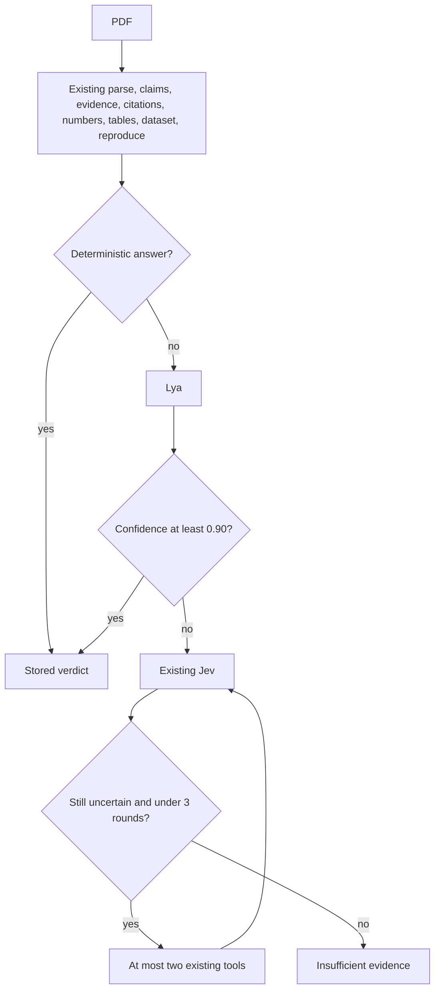

# ArxAudit verification build plan

Source brief: `/Users/sohaibqurashi/Documents/ArxAudit_Complete_Product_Technical_Build_Brief.md`. Current state: [docs/technical-state.md](docs/technical-state.md).

Deadline: Sep 27, 12:00pm EDT. One person. Do the chunks in order. After a chunk passes, commit it and push.

## Work

The checker and the screen are already in the repo. Do not rebuild them. The Lya client is already inside the existing verify stage, and it still calls a stock chat model. A finished number, table formula, or rerun stays final; otherwise Lya runs; the existing Jev call runs only when Lya is under `0.90`. Chunk 4 is the fine-tune. Do not train on generic question-answering, and do not train on unverified reviewer clicks.

### Chunk 1 — One owner

`services/orchestrator/desk.py`, `app.py`, `tests/test_desk.py`.

One fixed owner. Listing conferences does not depend on a Supabase user id. The one list is the conference already used for the demo. Do not delete its papers.

### Chunk 2 — Signup leaves the chair path

Same API files. `POST /desk/signup` and `POST /desk/accounts/link` are not how the chair gets a list. Keep the functions if a test still calls them. Replace `test_signup_conferences_stay_on_that_account` with a test that a second signup is not how a list is created, and that the desk has one owner.

### Chunk 3 — One list on the screen

`apps/web` desk pages. `/desk` opens that one list. Remove the conference picker and the sign-up form. Sign-in, if a gate stays for the demo, is one account.

### Chunk 4 — Fine-tune Lya

`services/orchestrator/fixtures/lya_train.jsonl`, a new `lya_holdout.jsonl`, and `LYA_MODEL`.

Each training row is only a claim, the evidence rows, and a label: `supported`, `contradicted`, `not_mentioned`, or `ambiguous`. Grow the file past the seed so it includes the hard cases: the same number on a different metric, percent versus percentage points, abstract versus results, and a table that disagrees with the prose. Put a smaller set of those cases in `lya_holdout.jsonl` and do not upload that file.

Upload `lya_train.jsonl` as an xAI fine-tune of a fast chat model. When the job finishes, set `LYA_MODEL` to that model id. Until then the desk keeps the current client. Score the holdout by verdict. If a high confidence is often wrong, raise `LYA_THRESHOLD` above `0.90` before the live run. The client still returns only `{verdict, confidence}` and still does not search, run code, or parse a PDF.

### Chunk 5 — Live run

Run the demo paper on one machine with real keys and the fine-tuned `LYA_MODEL`. Expected: 95.2 vs 61.0 contradicted, with the Lya step when Lya is sure; 7.8 vs computed 4.5 contradicted; Smith 2099 unresolved only when all three catalogs answer and none match; Vaswani 2017 resolved; Titanic 342 reproduced; 317 could not reproduce with actual 216; at least one semantic claim supported.

### Chunk 6 — Regress the other two papers

Run `0000.00001` and `0000.00002` after chunk 5 and confirm nothing regressed.

### Chunk 7 — Demo script

Write `docs/demo-script.md` with the clicks, the judge explanation, and the lines never to say. Update `docs/pitch.md` and `docs/technical-state.md` to match.

## What changes and what stays

**Stays.** The Next.js desk, the FastAPI checker, the SQLite desk DB, the pdf.js viewer, arXiv intake, the fixtures, Grok for chat prose, and the playbook modules. Typed claims, MiniLM evidence, the three catalogs, table arithmetic, the pandas DSL, and the Kaggle rerun stay. Jev stays the uncertain-claim judge. Screen words stay the ones already on the card. No fraud, no AI-written, and likeness is never a finding. Supabase stays only if one demo sign-in is still required. It is not a multi-account system.

**This adjustment.** One list, instead of a conference picker and a signup. Lya called from the existing verify stage, in front of the existing Jev call, after its weights are fine-tuned on claim-and-evidence rows.

**Already in the repo. Do not redo.** Claim rows, embeddings, catalog lookup, table formulas, dataset compile and execute, the finding chain, and PDF upload.

**Cut.** Cross-run playbook learning, Level 5 reproduction, contrastive kernel, Kaggle as compute, likeness on the desk. Do not add `CORRELATION`. Do not execute model-written Python.

## Pipeline

The stages below the judge are the ones already built. Lya is only the new gate in front of Jev.

## Vocabulary

- Jev labels: `supported`, `contradicted`, `not_mentioned`, plus `confidence` 0–1.
- Claim verdicts stored: `supported`, `contradicted`, `not_mentioned`, `unresolved`, `ambiguous`, `reproduced`, `could_not_reproduce`, `insufficient_evidence`, `not_checked`.
- Screen words: Supported, Contradicted, Unresolved, Not found, Reproduced, Could not reproduce, Insufficient evidence, Requires human review, Not checked.
- Paper words on the dashboard: `Verified` when no finding, `N findings` otherwise, `Running`, `Waiting`, `Not read`.
- A finding is a claim whose verdict is `contradicted`, `unresolved`, `could_not_reproduce`, or `insufficient_evidence`. `not_mentioned` on a semantic claim with high confidence is also a finding. `ambiguous` and `not_checked` are shown but are not findings.
- Never write fake, fraudulent, fabricated, or AI-written. A citation missing from three catalogs is "could not be independently resolved in the catalogs searched."
- Network failure is `not_checked`, never `unresolved`.

## Rules that still bind

- Public data only. No email to authors, no posting verdicts. Keys server-side, never `NEXT_PUBLIC_`. `.env` stays untracked.
- Do not edit source to make a run pass. Patches are typed and go through the playbook.
- Jev decides when Lya is unsure. Software retrieves and computes. No model-written code is executed; the DSL is the only executor.
- Likeness is never a finding. The probe stays off the desk.
- Every Python chunk has pytest. Every screen chunk has a named browser check. Finish a chunk before the next one.
